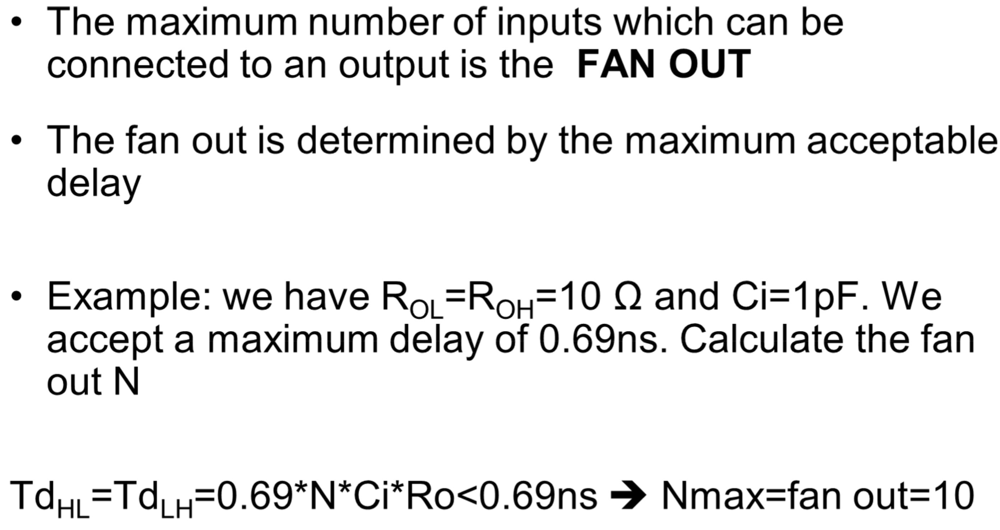
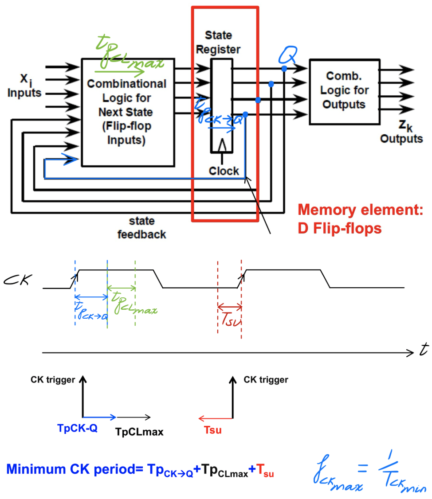
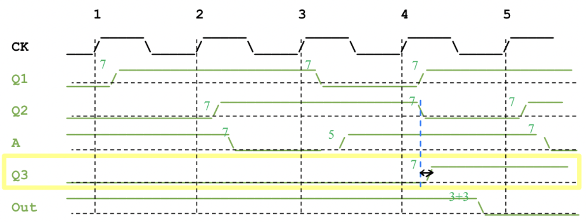

# Fundamental Electric Variables

# Digital Electronics

## MCQ

*   Consider a square wave generator realized with Schmitt trigger inverter: the voltage on the capacitor varies with time as ==exponential==; The voltage out of the Schimitt trigger inverter is ==square wave==; The perid T of the square wave can be approximated with ==T = RC==

    

*   $V_O$ is the output voltage of a logic gate, choose the right condition for connecting $V_O$ to the input of another logic gate (the voltage supply is $V_{DD}$): 

    -   [x] $V_O=V_{IH}+NM$

    

*   One logic gate with output resistance $R_O$ is driving 6 inverters with input capacitance $C_i=5pF$. The propagation delay of a L->H transitions is:

    -   [x] $4.14\times R_O \times C_i$

    

*   The maximum number of CMOS logic gates that can be connected to one CMOS logic gate of the same family is limited by:
    -   [x] the maximum acceptable delay for a logic state transition

*   Fan out of a CMOS logic gate is determined by: 
    -   [x] the maximum acceptable delay $t_{HL,max}$
    
    

*   The static power consumption of a digital CMOS circuit depends on:?
    -   [x] the leakage current of MOS transistors in ==OFF== state

*   Consider 2 CMOS digital circuits with, in average per time instant, about 1E6 and 1E8 MOS transistors in OFF state respectively. Choose the correct sentence: 
    -   [x] The static power consumption of the circuit with 1E6 MOS is about one hundred times smaller that the circuit with 1E8 MOS

*   If we reduce of a factor of 2 the voltage supply $V_{DD}$ of a CMOS logic gate, then the dynamic power consumption:

    -   [x] reduces of factor 1/4

    $$
    \begin{align*}
    \boxed{P_D=F\times C\times V^2_{DD}}
    \end{align*}
    $$

*   Assuming that the delay of a combination logic block of a sequential circuit is $T_{cl}$, choose the correct expression for the minimum CK period of the sequential circuit:

    -   [x] $T_{CK->Q}+T_{set-up}+\boxed{MAX(T_{cl})!!}$

    

*   Consider 3 CMOS inverters I1, I2 and I3 with 3 states output. The 3 inverters are connected to a bus line. The line voltage is HIGH when:

    -   [x] Output of ==I3 is HIGH== and ==I1 and I2 are in high-Z state==

    

*   Consider a D-FF. Select the correct sentence:

    -   [x] During the set-up time D must not change
    -   [ ] D must be always 1 during the set-up time
    -   [ ] D must be always 0 durring the set-up time
    -   [ ] During the set-up time D must change no more than 2 times

    

*   Consider a JK-FF:

    -   [x] The output Q ==toggles== at each CK trigger when ==J=K=1== provided that the set-up constain is satisfied

    

## TQ

*   Consider the combinational logic function: **Out = not(A or (B and C))** realized in CMOS technology

    1)   Plot the circuit

         

    2.   Assuming the MOS transistors have Ron = 70 $\ohm$, calculate the maximum delay for H-L and L-H transition to drive 5 gates with input capacitance Ci = 5pF each

    

# Interconnections

## MCQ

*   Consider a driver connected to a transmission line with 20 receivers connected. The loaded line ==characteristic impedance== is:

    -   [x] Smaller than the unloaded line characteristic impedance

    $$
    \begin{align*}
    Z_{\infty}&=\sqrt{\frac{L_U}{C_U}}\\
    C'_U&=C_U+\frac{C_iN}{L}>C_U\\
    Z'_{\infty}&=\sqrt{\frac{L_U}{C'_U}}<Z_{\infty}
    \end{align*}
    $$

*   Consider a synchronous write cycle; The maximum delay between INF at source and INF at destination is:
    -   [x] $T_{tx,max}=T_{tx,min}+T_k$

*   Consider a ==synchronous write cycle==; The STB signal must stay high for a minimum duration equal to:

    -   [x] $T_h+T_k$

    

    

*   Consider an ==asynchronous write cycle==; When does the STB signal go high after the INF:

    -   [x] STB goes high after $t_k$

    

    

*   Consider a voltage step propagating in a transmission line with open circuit termination, $R_O=Z_{\infty}$ and $V_{DD}=2V$. The ==first incident voltage step== is:

    -   [x] 1 V

    $$
    \begin{align*}
    V_B(0)=\frac{Z_{\infty}}{Z_{\infty}+R_O}V_{DD}=\frac{V_{DD}}{2}=1V
    \end{align*}
    $$

    

*   The reflection coefficient of a matched termination of a transmission line is:

    -   [x] 0

    

*   A driver with voltage supply $V_{DD}$ and output resistance $R_O$ drives a transmission line with characteristic impedance $Z_{\infty}$; The line is terminated with a resistor $R_{T}$. After the transient of L->H transition, the line ==steady state voltage== is:
    -   [x] $V_{DD}\frac{R_{T}}{R_{T}+R_{O}}$

*   ==Asynchronous serial== protocol: the number of information bits that can be transmitted between the start and stop bit is:

    -   [x] Limited to a few bits depending on how often the CK needs to be resynchronized

    

*   Consider a ==synchronous serial protocol==. The protocol requires:

    -   [x] An encoding technique (eg: Manchester, BxBy etc...) for synchronization of the data at the receiver side

    

 

*   Consider a voltage step propagating in a transmission line matched termination, $R_O=Z_{\infty}$ and $V_{DD}=2V$. Only one of these sentences is correct, select it:
    -   [ ] The voltage at termination is null
    -   [ ] The voltage at termination can be higher than $V_{DD}$
    -   [x] The power consumption at termination is $P_D=\frac{V^2_{DD}}{4Z_{\infty}}$
    -   [ ] The power consumption at termination is $P_D=\frac{V^2_{DD}}{2Z_{\infty}}$

## TQ

*   A track of 30 cm on a PCB backplane has characteristic impedance $Z_{\infty}=90\ohm$ (with no load), and wave propagation speed u = 0.6 c (==$1c=3\times10^{8}m/s$==). We need to connect to the track N = 10 equally spaced receivers. Each device has an input capacitance of 1pF. The line is driven on one side and closed with a matched termination on the other side.

    The driver and receivers have the following electrical parameters:

    $V_{oh}=4.1V, V_{ol}=0.4V, V_{ih}=2.5V, V_{il}=1.0V, V_{DD}=4.5V$

    1.   Calculate the capacitance per unit length of the line without any connected device
         $$
         \begin{align*}
         \boxed{Z_{\infty}=\sqrt{\frac{L_U}{C_U}},~u=\frac{1}{\sqrt{L_UC_U}}}~\rightarrow~\boxed{C_U=\frac{1}{Z_{\infty}u}}
         \end{align*}
         $$

    2.   Calculate the characteristic impedance of the line with the connected receivers
         $$
         \begin{align*}
         \boxed{C'_U=C_U+\frac{C_iN}{L}}~\rightarrow~Z'_{\infty}=\sqrt{\frac{L_U}{C'_U}}=\sqrt{\frac{L_U}{C_U}}\sqrt{\frac{1}{1+\frac{C_iN}{C_UL}}}
         \end{align*}
         $$

    3.   Calculate the output resistance of the driver to drive the line in ==IWS mode== and NM = 0.5V. Include in the calculation the effect of the capacitive load.
         $$
         \begin{align*}
         \frac{Z'_{\infty}}{Z'_{\infty}+R_O}V_{DD}\geq \boxed{V_{ih}}+NM
         \end{align*}
         $$

*   One driver with $V_{DD}=3.3V$ is connected on one side of a transmission line with $Z_{\infty}=60\ohm$, propagating speed $U=0.7c$, length 15cm and open circuit termination. The receivers are CMOS circuits with $V_{il}=1V, V_{ih}=2.2V$. Answer the following questions for a L->H transition:

    1.   Calculate the range of $R_O$ to drive the line in ==RWS mode== and not in IWS mode, when only one receiver is connected at the near-end of the line

         

         *   To avoid the switching on IWS mode we must set: 
             $$
             V_B(0)=\frac{Z_{\infty}}{Z_{\infty}+R_O}V_{DD}<\boxed{V_{ih}}~\rightarrow~R_O>30\ohm
             $$

         *   In RWS mode the voltage at $V_B(2t_p)$ must be recognized as high:
             $$
             V_B(2t_p)=(1+\Gamma_C+\Gamma_C\Gamma_B)V_B(0)=2V_B(0)=\frac{2Z_{\infty}}{Z_{\infty}+R_O}V_{DD}>\boxed{V_{ih}}\\
             ~\rightarrow~R_O<120\ohm
             $$

         *   Combine (1) and (2): $30\ohm<R_O<120\ohm$

    2.   With $R_O=80\ohm$, calculate the maximum and minimum transmission times and the skew for a receiver connected in the near-end and a receiver connected in the far-end
         $$
         \begin{align*}
         t_p&=\frac{L}{U}=0.71ns \\
         \Gamma_B&=\frac{R_O-Z_{\infty}}{R_O+Z_{\infty}}=0.14,~\Gamma_C=\frac{R_T-Z_{\infty}}{R_T+Z_{\infty}}=1 \\
         V_B(0)&=\frac{Z_{\infty}}{Z_{\infty}+R_O}V_{DD}=1.4V>\boxed{V_{il}} \tag{1} \\
         V_C(t_p)&=(1+\Gamma_C)V_B(0)=2.8V>\boxed{V_{ih}} \tag{2} \\
         V_B(2t_p)&=(1+\Gamma_C+\Gamma_C\Gamma_B)V_B(0)=3V>\boxed{V_{ih}} \tag{3} \\
         \end{align*}
         $$

         *   For the receiver connected to the near-end:

             $t_{TXmin}=0$ because (1)

             $t_{TXmax}=2t_p$ because (3)

         *   For the receiver connected to the far-end:

             $t_{TXmin}=t_{TXmax}=t_p$ because (2)

         *   So the skew is $t_k=t_{TXmax}-t_{TXmin}=2t_p=1.42ns$

    3.   This interconnection is used for a parallel **synchronous** write bus protocol. The receiver registers have set-up time $t_{SU}=5ns$ and hold time $t_H=2ns$. Calculate the delay between the DATA and STB signals and the duration of the write cycle

         *   Delay between DATA & STB: $t_A=t_k+t_{SU}=6.42ns$
         *   Duration of the write cycle: $t_{tot}=2t_k+t_{SU}+t_H=9.84ns$

         

*   Driver: $V_{oh}=4.1V, V_{ol}=0.4V, I_{oh}=I_{ol}=15mA, V_{DD}=4.5V~\rightarrow~$ ==$R_O=\frac{0.4V}{15mA}$==

*   Consider the sequential circuit shown in the figure: all outputs Q are initially set to Q = 0

    

    1.   Plot the timing diagram of the outputs Q1, Q2, A, Q3 and Out for CK cycles

         All FFs: $T_{ck->Q}=7ns,~ T_{set-up}=4ns,~ T_{hold}=1ns$

         NAND gate: $T_{HL}=7ns,~ T_{LH}=5ns$

         Gate B1 and B2 $T_{HL}=T_{LH}=3ns$

         

    2.   Assuming B2 of 1.5pF, calculate the pull-up resistance Rpu to guarantee delay L->H less than 4ns
         $$
         \begin{align*}
         \boxed{t_{LH}=0.69\times R_{pu}\times C_i}=4ns~\rightarrow~R_{pu}\leq3.9k\ohm
         \end{align*}
         $$

    3.   If the CK frequency is 60MHz, is the circuit working corretly?

         The maximum CK frequency is determined by the most stringent one:
         $$
         \begin{align*}
         T_{ck,min}&=T_{ck->Q}+T_{NAND,max}+T_{set-up}=7+7+4=18ns \\
         f_{ck,max}&=\frac{1}{T_{ck,min}}=55.56MHz<60MHz
         \end{align*}
         $$
         The answer is YES; because the maximum CK frequency doesn't exceed the CK frequency; **If it does, FF1 will enter in metastable state**

# Data Acquisition System

## MCQ

*   Consider a 10 bit A/D conversion system with dynamic range [0, 10V], the ==precision== is:

    -   [x] ~0.1%

    $$
    \begin{align*}
    \boxed{\frac{1}{2^N}}=\frac{1}{2^{10}}
    \end{align*}
    $$

*   How many resistors are required in an 8 bit weighted resistor DAC?

    -   [x] 8+1

    

*   Consider a 8 bit weighted resistors DAC. The resistor of the MSB branch has an error of -5%. Which is the error that we find in the DAC characteristic?

    -   [x] ==Non linear error==

    

## TQ

1.   **Protection Circuit** to limit the analog signal input voltage to the safe limit
2.   **Conditioning Amplifier** to bring the input voltage to the range of the ADC
3.   **Low-pass Filter** to reduce the aliasing error by limiting bandwidth
4.   **Multiplexer** to allow input to be used by multiple channels
5.   **S/H** to sample the signal at discrete time intervals
6.   **ADC** to convert analog signals to digital

*   Consider a data acquisition system with 5 input channels. The signal in each channel **can be a triangular wave or a sine wave** both with amplitude -500mV and maximum frequency 3kHz. The signal must be converted using only one A/D converter with input dynamics [-5V, 5V].

    1.   Draw the trans-characteristics of the conditioning amplifier and design the circuit

         

         *   Another example of drawing the amplifier when the offset is present

             
    
    2.   Calculate the signal to noise ratio due to quantization error (SNRq) for both signals. The SNRq must be expressed as function of the number of bits N and of the A/D dynamics S
    
         *   For ==triangular== signal: 
             $$
             \begin{align*}
             SNR_{q,dB}&=10~log_{10}\frac{P_S}{P_{\epsilon_q}}=10~log_{10}\frac{S^2}{12}\frac{12}{A^2_D} \\
             A_D&=\frac{S}{2^N}~\rightarrow~SNR_{q,dB}=\boxed{6N~dB}
             \end{align*}
             $$
             
         *   For ==sinusoidal== signal: 
             $$
             \begin{align*}
             SNR_{q,dB}&=10~log_{10}\frac{P_S}{P_{\epsilon_q}}=10~log_{10}\frac{S^2}{8}\frac{12}{A^2_D} \\
             A_D&=\frac{S}{2^N}~\rightarrow~SNR_{q,dB}=\boxed{6N+1.76~dB}
             \end{align*}
             $$
         
    3.   Calculate the number of bits N of the A/D converter to guarantee SNRq > 28 dB
    
         **We must consider the worst case that is the traingular signal**: $6N>28~dB~\rightarrow~N=5$
    
    4.   Assuming that the other sources of errors reduce the SNR of other 8 dB calculate the ENOB
    
         *   In the case of the sine wave and N = 5 we have: 
    
         $$
         \begin{align*}
         SNR_{tot}=SNR_q-8~dB=6N+1.76~dB&-8~dB=23.76~dB \\
         \boxed{ENOB=\frac{SNR_{tot}-1.76}{6}}&=3.67
         \end{align*}
         $$
    
    5.   The A/D is a successive approximation converter: calculate the clock frequency necessary to sample the signals with an over-sampling factor of 1.5. Assume that the S/H has an acquisition time of 10$\mu s$
    
         *   To sample with oversampling factor K = 1.5 we must sample one single channel with sampling frequency:
             $$
             \begin{align*}
             \boxed{f_{s1}=1.5\times 2\times f_{i,max}}=9kHz
             \end{align*}
             $$
    
         *   The S/H samples at frequency:
             $$
             \begin{align*}
             \boxed{f_{S}=N_{channels}\times f_{s1}}=45kHz
             \end{align*}
             $$
    
         *   During one sampling period we must fit the switching time of the MUX, the acquisition of the signal and the conversion time of the ADC:
             $$
             \begin{align*}
             \boxed{T_{S}=\frac{1}{f_{S}}=T_{acq}+T_{MUX}+T_C}=22.23\mu s
             \end{align*}
             $$
    
         *   We assume the delay of the MUX is negligible , we find:
             $$
             \begin{align*}
             T_C=T_{S}-T_{acq}=12.23\mu s=N\times T_{ck}~\rightarrow~f_{ck}=\frac{5}{12.23\mu s}=408kHz
             \end{align*}
             $$
    
    
    
*   A 8 bits A/D tracking converter is used to convert a sine wave with amplitude $1V_{PP}$. The CK frequency of the converter is $f_{CK}=1MHz$, the DAC has 1LSB = 10mV

    1.   Calculate the maximum sine wave frequency to avoid overload condition

         
         $$
         \begin{align*}
         \boxed{max\{\frac{dV}{dt}\}<\frac{A_D}{T_{CK}}}~where~V(t)=0.5V_{PP}\cdot sin(2\pi ft) \\
         0.5V_{PP}\cdot2\pi f<\frac{A_D}{T_{CK}}~\rightarrow~f_{max}=\frac{A_D}{V_{PP}}\frac{f_{CK}}{\pi}=3.2kHz
         \end{align*}
         $$

    2.   Calculate the conversion time when the converter works in tracking mode

         *   **In tracking mode, the ADC can follow the input signal by increasing/decreasing the output of 1 bit during each clock period**, so the conversion time is equal to the CK period: $T_C=T_{CK}=1\mu s$

    3.   If the same input sine wave is converted with 8 bit successive approximation ADC with $f_{CK}=1MHz$, calculate the maximum frequency of the sine wave that can be converted

         *   By employing a SAR ADC, we have $T_C=N\cdot T_{CK}=8\mu s$
         *   The minimum sampling period is $T_S=T_C+T_{acq}$, therefore the maximum sampling frequency is $f_S=\frac{1}{T_C+T_{acq}}$
         *   Nyquist rules: $f_{i,max}=\frac{1}{2}f_S=\frac{1}{2}\frac{1}{T_C+Tacq}=52.6kHz$

*   Assuming the A/D is a successive approximation converter with following characteristics: DAC with settling time 80ns, SAR with $t_{CK->Q}=10ns$, voltage comparator with negligible delay. Calculate the maximum clock frequency
    $$
    \begin{align*}
    f_{CK,max}=\frac{1}{T_{CK,min}}=\frac{1}{t_{settl}+t_{CK->Q}+t_{comp}}=\frac{1}{80ns+10ns}=111MHz
    \end{align*}
    $$
    

# Memories

## MCQ

*   The maximum speed of a 8 bit DRAM DDR3 (**operations on both the rising and falling clock edges, so we need times 2**) module with bus clock at 1000MHz is:
    -   [x] 16 Gbit/s

*   A NAND Flash memory consists in:

    -   [x] FAMOS transistors in series

    

*   Consider a NAND flash memory: the elementary units for erasing and writing operations are:

    -   [x] block (= erasing of several pages) and page (=elementary unit that can be written)

    

*   Consider a FLASH memory. The PAGE is:
    -   [x] The ==minimum== unit for reading

*   A FAMOS when programmed:

    -   [x] has a threshold voltage higher than the threshold voltage of the FAMOS which is not programmed

    

*   An FAMOS transistor in an EPROM memory uses:
    -   [x] the ==avalanche effect for programming==, the ==UV rays for erasing==

## TQ

*   Consider a DRAM memory with 8 bit address (all 8 bits are used for row decoder) and 8 bit word. Pass transistors have drain parassitic capacitance $C_d = 0.2fF$ and threshold voltage $V_{TH} = 0.1V$, voltage supply is  $V_{DD} = 1V$

    1.   Calculate

         *   number of bit lines: 8
         *   number of rows: $2^8=256$    => 256 pass transistor connected to one bit line
         *   total number of pass transistor: $256\times8=2048$

    2.   Calculate the minimum value of the storage capacitor Cs (Cbit in a bit cell), if the sense amplifier can sense a minimum voltage level of 70mV

         *   The parassitic capacitance of the BL is:
             $$
             \begin{align*}
             \boxed{C_{BL}=\#rows\times C_d}=2^8\times0.2fF=51.2fF
             \end{align*}
             $$

         *   The bitline variation of the voltage during the read must be sensed by the amplifier therefore must be higher than 70mV
             $$
             \begin{align*}
             \boxed{\Delta V_{BL}=\frac{C_S}{C_S+C_{BL}}(\frac{V_{DD}}{2}-V_{TH})}>70mV
             \end{align*}
             $$

*   You are given a DRAM memory with 10 bits used for row decoding and 6 bits used for column decoding, with each word of 8 bits. Pass transistors have a drain capacitance of $C_d = 0.1fF$ and the voltage supply is $V_{DD} = 1.2V$
    1.   Calculate
         *   size in ==bytes== of the memory: $\frac{2^6\times8\times2^{10}}{8}=64Kbytes$
         *   number of bit lines: $2^6\times8=512$
         *   number of pass transistors connected to each bit line: $\#rows=2^{10}=1024$
         *   total number of pass transistors in the memory: $\#rows\times\#bitlines=1024\times512=524288$
    2.   Explain the difference between the following acronyms: DRAM, SDRAM, DDR SDRAM
         *   **DRAM**: dynamic RAM
         *   **SDRAM**: synchronous dynamic RAM, no longer asynchronous, the control and command signals are triggered by a rising edge of the clock signal
         *   **DDR SDRAM**: Advanced SDRAM memory that uses both clock edges

*   Consider a DRAM with storage capacitance $C_S = 30fF$ and pass transistor with drain capacitance $C_d = 0.2fF$. The row address has 11 bit and the column address 6 bit. The word line is 8 bit. Voltage supply is $V_{DD} = 1V$

    1.   Calculate the maximum variation of the voltage of the bit line after reading a logic "1" from the cell and after reading a logic "0" from the cell. If the sense amplifier can sense a minimum voltage of 40mV, is it possible to read the bit value? why?
         $$
         \begin{align*}
         C_{BL}&=\#rows\times C_d=2^8\times0.2fF=51.2fF \\
         \Delta V_{BL}&=\frac{C_S}{C_S+C_{BL}}(V_{bit}-V_{BL}-V_{TH})~~~where~V_{BL}=\frac{V_{DD}}{2}, V_{TH}=0
         \end{align*}
         $$

         *   ==for reading "1"==: $V_{bit}=V_{DD}~\rightarrow~\Delta V_{BL}=34mV$
         *   ==for reading "0"==: $V_{bit}=0V~\rightarrow~\Delta V_{BL}=-34mV$

         $\Delta V_{BL}$ is smaller than minimum voltage that sense amplifier can discriminate, so the sense amplifier can not read the bit

    2.   Assuming the DRAM cell has a leakage current of 35fA, calculate the refresh period to keep the Cs voltage variation (due to leakage) lower than 0.05V
         $$
         \begin{align*}
         \boxed{i=C_S\frac{\Delta V}{\Delta t}}~\rightarrow~\Delta t=C_S\frac{\Delta V}{i}=30pF\times\frac{0.05V}{35fA}=42.9ms
         \end{align*}
         $$

    

*   Consider a DRAM with 16 wordlines, each word line is connected to 8 cells. The pass transistor of each cell has a gate capacitance of 0.2fF. The MOS transistors of all the gates of the decoder have a resistance $R_{ON}=40\ohm$

    1.   Calculate the number of inverters and the number of NAND gates required by the decoder

         

         *   We have 16 wordlines that we address with 4 bits used as row address, so we have 4 inverters as input to 16 NAND gates ==+ 16 inverters==, in total is 20 inverters & 16 NAND gates

    2.   Calculate the delay between the input address signal and the activation of the WL. Assume the WL has a resistance $R_{WL}=20\ohm$

         

         

         We assume the MOS transistor of the gates has same $C_G=0.2fF$

         *   Delay of first block of inverters (the output of each inverter is input to ==8== ($2^4/2$) NAND gates): 
             $$
             \begin{align*}
             t_{d,l1}=0.69\times R_{ON}\times8\times\boxed{2C_G}=0.09ps
             \end{align*}
             $$

         *   Delay of NAND gates: output of each NAND gates is input to one inverters
             $$
             \begin{align*}
             t_{d,NAND}=0.69\times\boxed{4}R_{ON}\times2C_G=0.045ps
             \end{align*}
             $$

         *   Delay of second inverters: each of these inverters activate the WL, the total capacitance of the WL is ==$C_{WL}=8\times0.2fF=1.6fF$==
             $$
             \begin{align*}
             t_{d,l2}=0.69\times\boxed{(R_{WL}+R_{ON})}\times C_{WL}=0.26ps
             \end{align*}
             $$

         *   So the total delay is $0.09ps+0.045ps+0.26ps=0.4ps$

# Programmable Logic

## MCQ

*   Consider a FPGA: a Look-up Table (LUT) with 3 inputs needs:

    -   [x] 8 SRAM memory cells ($2^3=8$)
    -   [ ] 8 FAMOS
    -   [ ] 4 NAND gates and 8 NOR gates
    -   [ ] 8 NAND gates and 4 NOR gates

    

*   A Look-up Table (LUT) with 4 inputs and 1 output:
    -   [ ] can implement a logic function of 16 variables
    -   [ ] it contains 4 memory cells
    -   [x] can implement a logic function of 4 variables
    -   [ ] it contains 8 memory cells

*   A FPGA consists in:
    -   [x] LUT, MUX and registers
    -   [ ] Arrays of OR gates
    -   [ ] Arrays of AND gates
    -   [ ] Arrays of SRAM cells

*   The ==main== components of a logic element of an FPGA are:
    -   [x] Look-up-table (LUTs) and Flip-Flops (FFs)
    -   [ ] Multiplexers and FFs
    -   [ ] LUTs and Multiplexers
    -   [ ] Programmable AND plane and fixed OR plane

# Power Devices

## MCQ

*   Converters DC -> DC, with various topologies

    -   **Buck**: $V_O<V_I$
        $$
        \begin{align*}
        \frac{V_O}{V_I}=D~~~where~D=\frac{T_{ON}}{T_{ON}+T_{OFF}}
        \end{align*}
        $$

    -   **Boost**: $V_O>V_I$
        $$
        \begin{align*}
        \frac{V_O}{V_I}=\frac{1}{1-D}
        \end{align*}
        $$

    -   **Buck-boost**: $V_O<V_I$ or $V_O>V_I$, reversed polarity
        $$
        \begin{align*}
        \frac{V_O}{V_I}=-\frac{D}{1-D}
        \end{align*}
        $$

    -   **Flyback**: Buck-boost with galvanic insulation

*   The efficiency (ie: ratio between output and input power) of a series linear voltage regulator, with input $V_I$ and output $V_O$ can be approximated as:
    -   [x] $V_O/V_I$

*   Series voltage regulators: the efficiency is:
    -   [x] < 1

*   Consider a full-wave rectifier, the ripple voltage is proportional to the wave period T as:

    -   [x] T/2

    

    If we substitute a full-wave rectifier with a half-wave rectifier, the power associated to the ripple voltage noise will scale of a factor equal to ==4==

    

