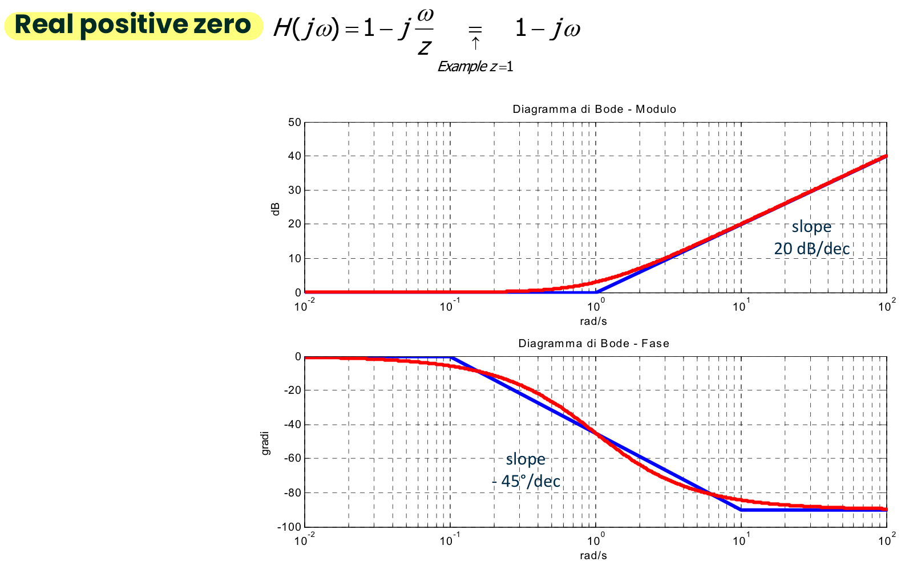
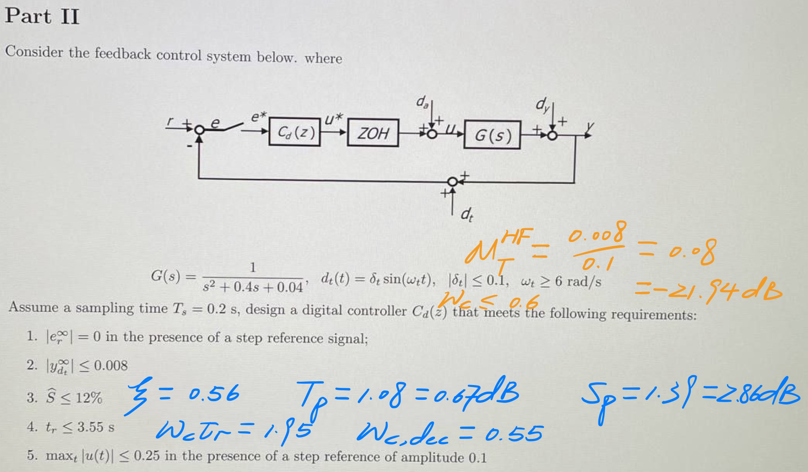

# Multiple Choices

## State Space Representation


*   

    ```matlab
    >> s = tf('s');
    % If we need to compute H(s), we can use
    % sys = ss(A, B, C, D); H = tf(sys)
    >> H = 1 / (s^2 - 4*s + 13); U = 8 / (s^2 + 4);
    >> Y = zpk(minreal(H * U, 1e-3));
    >> [num_Y, den_Y] = tfdata(Y, 'v');
    >> [r, p] = residue(num_Y, den_Y)
    r =
      -0.1103 + 0.0092i
      -0.1103 - 0.0092i
       0.1103 - 0.1241i
       0.1103 + 0.1241i
    p =
       2.0000 + 3.0000i
       2.0000 - 3.0000i
      -0.0000 + 2.0000i
      -0.0000 - 2.0000i
    >> M_1 = abs(r(1)); 2*M_1
    ans =
        0.2215
    >> phi_1 = angle(r(1))
    phi_1 =
        3.0585
    >> M_2 = abs(r(3)); 2*M_2
    ans =
        0.3322
    >> phi_2 = angle(r(3))
    phi_2 =
       -0.8442
    ```

    $\boxed{y(t)=(2M_1e^{Re(p(1))t} cos(Im(p(1))t+\phi_1)\epsilon(t)~+~(2M_2e^{Re(p(3))t} cos(Im(p(3))t+\phi_2)\epsilon(t)}$


## Internal Stability

*   Given the LTI system

    $\dot{x}(t)=Ax(t)+Bu(t)$

    $y(t)=Cx(t)+Du(t)$

    with

    $A = \begin{pmatrix}
        0 & -1 & 0 & 0 \\
        1 & 0 & 0 & 0  \\
        0 & 0 & 0 & -3 \\
        6 & 0 & 3 & 0
    \end{pmatrix}$

    which statement is true?

    -   [ ] The system is internally unstable
    -   [ ] The system is internally asymptotically stable
    -   [x] The system is internally (not asymptotically stable)
    -   [ ] We cannot evaluate the internal stability of the system as B is not given

    ```matlab
    >> A = [0 -1 0 0; 1 0 0 0; 0 0 0 -3; 6 0 3 0];
    >> eig(A)
    ans =
      -0.0000 + 3.0000i
      -0.0000 - 3.0000i
       0.0000 + 1.0000i
       0.0000 - 1.0000i
    ```

    *   ==All different $\lambda$ and all $Re(\lambda) = 0$ => internal stable==
    *   ==Not all $\lambda<0$ => Not asymptotically stable==


*   Given the LTI system

    $\dot{x}(t)=Ax(t)+Bu(t)$

    $y(t)=Cx(t)+Du(t)$

    with

    $A = \begin{pmatrix}
        0 & -1 & 0 & 1 \\
        2 & 0 & 1 & 0  \\
        0 & 0 & 0 & 1 \\
        0 & 0 & -2 & 0
    \end{pmatrix}$

    which statement is true?

    -   [ ] We can not evaluate the internal stability of the system as B, C, D are not known
    -   [ ] The system is internally asymptotically stable
    -   [x] The system is internally unstable
    -   [ ] The system is internally (not asymptotically) stable

    ```matlab
    >> A = [0 -1 0 1; 2 0 1 0; 0 0 0 1; 0 0 -2 0];
    >> eig(A)
    ans =
       0.0000 + 1.4142i
       0.0000 - 1.4142i
       0.0000 + 1.4142i
       0.0000 - 1.4142i
    >> s = tf('s')
    >> Q = zpk(minreal(inv(s * eye(4) - A), 1e-3))
    Q =
      From input 1 to output...
               s
       1:  ---------
           (s^2 + 2)
               2
       2:  ---------
           (s^2 + 2)
       3:  0
       4:  0
      From input 2 to output...
              -1
       1:  ---------
           (s^2 + 2)
               s
       2:  ---------
           (s^2 + 2)
       3:  0
       4:  0
      From input 3 to output...
              -3 s
       1:  -----------
           (s^2 + 2)^2
           (s+2) (s-2)
       2:  -----------
           (s^2 + 2)^2
               s
       3:  ---------
           (s^2 + 2)
              -2
       4:  ---------
           (s^2 + 2)
      From input 4 to output...
           (s-1) (s+1)
       1:  -----------
           (s^2 + 2)^2
               3 s
       2:  -----------
           (s^2 + 2)^2
               1
       3:  ---------
           (s^2 + 2)
               s
       4:  ---------
           (s^2 + 2)
    Continuous-time zero/pole/gain model.
    ```

    $q_A(s)=(s^2 + 2)^\boxed{2}$

    


## BIBO Stability


*   Given the LTI system

    $\dot{x}(t)=Ax(t)+Bu(t)$

    $y(t)=Cx(t)+Du(t)$

    is BIBO stable if and only if

    *   [x] All the system natural modes are convergent

    


## Steady State Response

*   Consider an LTI system with transfer function $H(s)=\frac{s+5}{(s+2)(s^2+1)}$. If the input is $u(t)=7sint, t\geq0$, then the steady state response $y_{ss}(t)$

    -   [x] can not be computed

    *   **As the system is ==minimal (No cancellation) and BIBO stable => asymptotically stable== => the steady state response can be computed**

    

*   Given an LTI system with transfer function $H(s)=\frac{s+5}{s^3+6s^2+50s+90}$, compute, if possible, the maximum magnitude of the steady state output response when the input is $u(t)=2+sin(4t),~t\geq0$

    -   [x] $max_t|y_{ss}(t)|=0.1581$

    ```matlab
    >> s = tf('s');
    >> H = (s + 5) / (s^3 + 6*s^2 + 50*s + 90);
    >> pole(H)
    ans =
      -1.9211 + 6.1659i
      -1.9211 - 6.1659i
      -2.1578 + 0.0000i
    % H is stable so we can compute the ss value
    
    >> K = dcgain(H)*2 % 2 because the magnitude of the step function is 2
    K =
        0.1111
    
    >> w0 = 4;
    >> [m, f] = bode(H, w0)
    m =
        0.0470 % we only need the magnitude; if sine function has magnitude, remember to time it to m
    f =
      -53.8663
    
    >> K + m
    ans =
        0.1581
    ```

    


## Bode Plots

*   

    -   [x] The poles are $p_1=0, p_2=-1, p_3=-20$

        The unique zero is $z=1$

        The generalized dc-gain is negative

    

    ```matlab
    % you can check
    >> H=(s-1) / (s*(s+20)*(s+1));
    >> bode(H)
    >> dcgain(s * H)
    ans =
       -0.0500
    ```


*   

    

    Suppose that the input $u(t)=(0.2+4sin(400t))\epsilon(t)$ is applied to the considered system. Then, based on the given Bode plots behaviour, compute, if possible, the analytical expression of the system steady state response $y_{ss}(t)$

    -   [ ] $y_{ss}(t)=2+0.04sin(400t+1.5708)$

    

    
    $$
    u(t)=(0.2+4sin(400t))\epsilon(t)=0.2\epsilon(t)+4sin(400t)\epsilon(t) \\
    0.2\epsilon(t)~\rightarrow~y_{ss}(t)=0.2\cdot H(0)~~~where~\boxed{20log_{10}H(0)=20}\\
    4sin(400t)\epsilon(t)~\rightarrow~y_{ss}(t)=4\cdot|H(j400)|sin(400t+\angle(H(j400))) \\where~\boxed{20log_{10}|H(j400)|=-40},~\angle(H(j400))=90\deg \\
    \boxed{弧度=角度\times \frac{\pi}{180}}
    \notag
    $$
    
    ==WRONG!!! Because the system is NOT STABLE, so it doesn't have steady state response==
    
    The transfer function is $H(s)=10\frac{1-s/10}{(1-s/2)^2}$
    
    
    
    ```matlab
    >> H = 10 * (1 - s/10) / (1 - s/2)^2;
    >> bode(H) % we can check
    >> Y = zpk(minreal(H * U, 1e-3));
    >> [num_Y, den_Y] = tfdata(Y, 'v');
    >> [r, p] = residue(num_Y, den_Y)
    r =
       -50
        80
        50
    p =
         2
         2
         0
    ```
    
    

## Feedback Control Systems

*   Consider the control system architecture in the figure

    

    where

    $C(s)=\frac{s+1}{s},~G(s)=\frac{1}{s-2}$

    Compute the analytical expression of the output $y(t)$ when $r(t)=d_a(t)=\epsilon(t)$ and $d_y(t)=0$

    -   [x] $(1+3.06e^{0.5t}cos(0.87t-1.9))\epsilon(t)$

    
    $$
    \boxed{H_r(s)=\frac{G(s)C(s)}{1+G(s)C(s)}}~\boxed{H_{da}(s)=\frac{G(s)}{1+G(s)C(s)}}~\boxed{H_{dy}(s)=\frac{1}{1+G(s)C(s)}}
    \notag
    $$

    ```matlab
    >> s = tf('s');
    >> C = (s+1)/s; G = 1/(s-2);
    >> H_r = (G*C) / (1+G*C); H_da = G / (1+G*C);
    >> U = 1 / s;
    >> Y_r = zpk(minreal(H_r * U, 1e-3)); Y_da = zpk(minreal(H_da * U, 1e-3));
    >> [num_Yr, den_Yr] = tfdata(Y_r, 'v'); [num_Yda, den_Yda] = tfdata(Y_da, 'v');
    >> [r_Yr, p_Yr] = residue(num_Yr, den_Yr), [r_Yda, p_Yda] = residue(num_Yda, den_Yda)
    r_Yr =
      -0.5000 - 0.8660i
      -0.5000 + 0.8660i
       1.0000 + 0.0000i
    p_Yr =
       0.5000 + 0.8660i
       0.5000 - 0.8660i
       0.0000 + 0.0000i
    r_Yda =
       0.0000 - 0.5774i
       0.0000 + 0.5774i
    p_Yda =
       0.5000 + 0.8660i
       0.5000 - 0.8660i
    ```

    $$
    Y(s)=\frac{1}{s}+\frac{-0.5-0.866i}{s-0.5-0.866i}+\frac{-0.5+0.866i}{s-0.5+0.866i}+\frac{-0.5774i}{s-0.5-0.866i}+\frac{0.5774i}{s-0.5+0.866i} \\
    =\frac{1}{s}+\frac{-0.5-1.4433i}{s-0.5-0.866i}+\frac{-0.5+1.4433i}{s-0.5+0.866i}\\
    \notag
    $$

    ```matlab
    >> r = -0.5-1.4433i;
    >> M = abs(r), M * 2
    M =
        1.5275
    ans =
        3.0549
    >> phi = angle(r)
    phi =
       -1.9043
    ```


*   In the control system depicted in the figure, we have $G(s)=\frac{2}{s^2+s-2}$

    which of the following controllers makes the control system stable?

    

    -   [x] $C(s)=\frac{5(s+0.5)}{s}$
    -   [ ] $C(s)=\frac{10(s-1)}{s}$
    -   [ ] $C(s)=\frac{4}{s}$
    -   [ ] More than one controller among those indicated in the other answers stabilizes the given control system

    

    *   ==Check stability of the feedback system==

        1.   ==There are not any unstable zero-pole cancellation in **L(s)**==
        2.   ==Check poles of a closed transfer function==

        The second has zero-pole cancellation in L(s), so we only need to verify the first and the third

        ```matlab
        >> s = tf('s');
        >> G = 2 / (s^2 + s - 2);
        >> C = 4 / s;
        >> L = G * C;
        >> H = zpk(minreal(L/(1+L), 1e-3));
        >> pole(H)
        ans =
          -2.7673 + 0.0000i
           0.8837 + 1.4526i
           0.8837 - 1.4526i
        % has poles which have positive real parts
        
        >> C = (5*(s+0.5)) / s;
        >> L = G * C;
        >> H = zpk(minreal(L/(1+L), 1e-3));
        >> pole(H)
        ans =
          -0.1783 + 2.7819i
          -0.1783 - 2.7819i
          -0.6435 + 0.0000i
        % all the poles have strictly negative real parts => stable
        ```

        

## Control Systems Design via Static State Feedback

*   Given the LTI system

    $\dot{x}(t)=\begin{pmatrix} 0.4 & 1 \\ -0.84 & 0.4 \end{pmatrix}x(t)+\begin{pmatrix} 0 \\ 0.5 \end{pmatrix}u(t)$

    $y(t)=\begin{pmatrix} 0.4 & 0 \end{pmatrix}x(t)$

    and the state feedback control law of the form $u(t)=-Kx(t)+Nr(t)$

    The control law gains are $K=\begin{pmatrix} 7.7198 & 5.6935 \end{pmatrix}$ and $N=20.4667$. Assume $x(0)=\begin{pmatrix} 0 & 0 \end{pmatrix}^T$ and evaluate through simulation the control performance in terms of maximum overshoot $\hat{s}$ when the reference input $r(t)$ is a step function

    -   [x] $\hat{s}\approx14\%$

    ```matlab
    >> A = [0.4 1; -0.84 0.4]; B = [0; 0.5]; C = [0.4 0]; D = 0;
    % Check reachability
    >> Mr = ctrb(A, B); rho_Mr = rank(Mr)
    rho_Mr =
         2 
    % 2 = rank(A), OK!
    >> K = [7.7198 5.6935]; N = 20.4667;
    % controlled LTI system
    >> sys_contr = ss(A-B*K, B*N, C, D);
    % simulation
    >> t_sim = linspace(0, 20, 10000); % simulation time base
    >> [y, t, x] = step(sys_contr, t_sim); % simulation results
    >> plot(t, y);
    ```

    


## Static Feedback of the Estimated State

*   

    ```matlab
    >> A = [-0.6 -1; 1 0]; B = [0.5; 0]; C = [0 3]; D = 0;
    % Check reachability and observability properties
    >> M_r = ctrb(A, B); rank(M_r)
    ans =
         2
    >> M_o = obsv(A, C); rank(M_o)
    ans =
         2
    >> K = [6.6 14.1]; N = 5.35; L = [119.5; 12.8];
    >> x0 = [-0.1; 0.1]; x0_hat = [0; 0];
    % Complete controlled system, i.e. control law + observer
    >> A_I = [A -B*K; L*C A-B*K-L*C];
    >> B_I = [B; B] * N;
    >> C_I = [C zeros(1, 2)];
    >> D_I = 0;
    >> sys_contr = ss(A_I, B_I, C_I, D_I);
    % simulation
    >> t_sim = linspace(0, 20, 10000);
    >> u_sim = ones(size(t_sim));
    >> [y, t, x_I] = lsim(sys_contr, u_sim, t_sim, [x0; x0_hat]);
    >> plot(t, y)
    ```

    


## Equilibrium

*   The state equation is following:

    $\dot{x_1}(t)=x_2(t)=\boxed{f_1(x(t),~u(t))}$

    $\dot{x_2}(t)=-0.75x_1(t)-0.25x^3_1(t)-0.75x_2(t)+u(t)=\boxed{f_2(x(t),~u(t))}$

    Compute all the equilibrium states $\bar{x}_1$ and $\bar{x}_2$ in the presence of the equilibrium force $\bar{u}=9N$

    -   [x] $\bar{x}'= \begin{bmatrix}
            3 \\
            0
        \end{bmatrix}=\boxed{\begin{bmatrix}
            \bar{x}_1 \\
            \bar{x}_2
        \end{bmatrix}}$

    *   Equilibrium condition: $\boxed{f(\bar{x}, \bar{u})=0}$

        $\bar{x}_2=0,~-0.75\bar{x}_1-0.25\bar{x}^3_1-0.75\bar{x}_2+9=0~\rightarrow~0.75\bar{x}_1+0.25\bar{x}^3_1=9$

        ```matlab
        >> syms 'x'
        >> eqn = 0.75*x + 0.25*x^3 == 9;
        >> solve(eqn)
        ans =
                              3
        - (39^(1/2)*1i)/2 - 3/2
          (39^(1/2)*1i)/2 - 3/2
        ```

        ==$\bar{x}$ belongs to $\R^n$==


*   

    
    $$
    A=\begin{pmatrix} \frac{\partial f_1}{\partial x_1} & \frac{\partial f_1}{\partial x_2} \\ \frac{\partial f_2}{\partial x_1} & \frac{\partial f_2}{\partial x_2} \end{pmatrix}_{|(x, u)=(\bar{x}, \bar{u})}~~
    B=\begin{pmatrix} \frac{\partial f_1}{\partial u} \\ \frac{\partial f_2}{\partial u} \end{pmatrix}_{|(x, u)=(\bar{x}, \bar{u})} \\
    C=\begin{pmatrix} \frac{\partial g}{\partial x_1} & \frac{\partial g}{\partial x_2} \end{pmatrix}_{|(x, u)=(\bar{x}, \bar{u})}~~
    D=\begin{pmatrix} \frac{\partial g}{\partial u} \end{pmatrix}_{|(x, u)=(\bar{x}, \bar{u})}
    \notag
    $$
    *   The right answer is B


*   Let us consider the linearized model of a non-linear dynamical system in the neighbourhood of a given equilibrium solution

    Let $\dot{\delta}x(t)=\tilde{A}\delta x(t)+\tilde{B}\delta u(t)$ be the equation of the state variation, where

    $\tilde{A} = \begin{pmatrix}
        0 & -1 & 0 & 0 \\
        1 & 0 & 0 & 0  \\
        0 & 0 & 0 & -3 \\
        6 & 0 & 3 & 0
    \end{pmatrix}$

    which statement is true?

    -   [x] No conclusion can be drawn about the stability of the equilibrium solution

    

    ```matlab
    >> A = [0 -1 0 0; 1 0 0 0; 0 0 0 -3; 6 0 3 0];
    >> eig(A)
    ans =
      -0.0000 + 3.0000i
      -0.0000 - 3.0000i
       0.0000 + 1.0000i
       0.0000 - 1.0000i
    ```

    $\tilde{A} = \begin{pmatrix}
        -1 & 0 & 1 & 2 \\
        0 & -1 & -2 & 0  \\
        0 & 1 & 0 & 0 \\
        -1 & 1 & 0 & 0
    \end{pmatrix}$

    which statement is true?

    -   [x] The equilibrium solution is ==asymptotically== stable

    ```matlab
    >> A = [-1 0 1 2; 0 -1 -2 0; 0 1 0 0; -1 1 0 0];
    >> eig(A)
    ans =
      -0.5000 + 1.3229i
      -0.5000 - 1.3229i
      -0.5000 + 1.3229i
      -0.5000 - 1.3229i
    ```


## DT LTI Systems


*   Given the DT LTI system represented by the transfer function $H(z)=\frac{z}{z^2+0.5z+0.25}$, compute the output response in the presence of the input $u(k)=\delta(k)$

    -   [x] $y(k)=2.31\cdot(\frac{1}{2})^k\cdot cos(2.1k-1.57)$

    ```matlab
    >> z = tf('z', 1);
    >> H = z / (z^2 + 0.5*z + 0.25); U = 1;
    >> Y = zpk(minreal(H * U, 1e-3));
    >> [num_Y, den_Y] = tfdata(Y, 'v');
    >> [r, p] = residuez(num_Y, den_Y)
    r =
       0.0000 - 1.1547i
       0.0000 + 1.1547i
    p =
      -0.2500 + 0.4330i
      -0.2500 - 0.4330i
    >> M = abs(r(1)), M*2
    M =
        1.1547
    ans =
        2.3094
    >> phi = angle(r(1))
    phi =
       -1.5708
    >> lambda = abs(p(1))
    lambda =
        0.5000
    >> theta = angle(p(1))
    theta =
        2.0944
    ```

    $$
    \boxed{y(k)=2|M|\cdot |\lambda|^{k} \cdot cos(\theta k+\phi)}=2.31\cdot(\frac{1}{2})^k\cdot cos(2.1k-1.57)
    \notag
    $$

    

*   

    

    ```matlab
    >> A = [-1 3 0 0; -4 -1 0 0; 0 0 0 0; 0 0 1 -1]; B = [-1; 1; 2; 1]; C = [0 0 0 1]; D = 0;
    >> eig(A)
    ans =
      -1.0000 + 3.4641i % this
      -1.0000 - 3.4641i % this
      -1.0000 + 0.0000i
       0.0000 + 0.0000i
    % exist |lambda(A)| > 1 => unstable
    
    >> z = tf('z', 1);
    >> H = zpk(minreal(C * inv(z*eye(4)-A) * B, 1e-3));
    >> pole(H)
    ans =
       -1.0000
       -0.0000
    % exist |p_i| >= 1 => BIBO unstable
    ```


*   Consider the discrete-time LTI system

    $x(k+1)=Ax(k)+Bu(k)$

    $y(k)=Cx(k)$

    where $T_s=1sec$, $A=\begin{bmatrix} 2.1 & 21 \\ 0 & -1.4 \end{bmatrix}$, $B=\begin{bmatrix} 0 \\ 12 \end{bmatrix}$, $C=\begin{bmatrix} 0 & 4 \end{bmatrix}$

    *   [ ] The system is BIBO stable
    *   [ ] Nothing can be said about the BIBO stability
    *   [ ] The system is internally asymptotically stable but BIBO unstable
    *   [x] The system is BIBO unstable

    *   $\boxed{H(z)=C(zI-A)^{-1}B+D}$

        A DT LTI system is **BIBO stable** if and only if all the poles $p_i$ of its transfer function H(z) lie strictly inside the unit circle, i.e., ==$|p_i|<1$== for all i = 1,...,n

        ```matlab
        >> A = [2.1 21; 0 -1.4]; B = [0; 12]; C = [0 4];
        >> z = tf('z', 1);
        >> H = zpk(minreal(C * inv(z*eye(2)-A) * B, 1e-3));
        >> zpk(H) % or we can use pole(H) get poles directly
        ans =
            48
          -------
          (z+1.4)
        % |-1.4| > 1 => BIBO unstable
        ```


## Digital Control Design

*   A digital controller has to be designed through the emulation approach to satisfy the following requirements: $\hat{S}\leq12\%,~t_r\leq1.9s$

    Choose an appropriate value of the sampling time $T_s$

    -   [ ] $T_s=0.05s$
    -   [ ] $T_s=1.1s$
    -   [x] $T_s=0.2s$

    *   A final practical rule of thumb is to choose $T$ within the interval:
        $$
        \boxed{\frac{0.12}{\omega_c}<T<\frac{0.3}{\omega_c}}
        \notag
        $$
        check the diagram we can see $\xi=0.56,~t_r\cdot\omega_c=1.9~\rightarrow~\omega_c=1~\rightarrow~0.12<T<0.3$


# Design


```matlab
clear all
close all
clc

s = tf('s');

G = -7044 / ((s - 29.68)*(s + 29.68));

% steady state controller
Kc = -1;
C_SS = Kc / s;
L1 = C_SS * G; % loop function update

% ZOH filter definition!!
Ts = 0.001;
G_ZOH = 1 / (1 + s * Ts / 2);
L11 = G_ZOH * L1; % loop function update to account for ZOH dynamic!!

% transient requirement
T_p = 2.67;
S_p = 4.35;
M_T_HF = -23.5;
wc_dec = 125;

% Nichols diagram for L11
figure(1)
nichols(L11, 'b'), hold on
T_grid(T_p)
S_grid(S_p)
T_grid(M_T_HF)
% axis([-360 -90 -150 -150])

% double real negative zero design
% wnorm = 3;
% wz = wc_dec / wnorm;
% C_Z = (1 + s/wz)^2;
% L2 = C_Z * L11; % loop function update
% C0 = C_Z * C_SS; % controller tf update!!
% figure(1), hold on
% nichols(L2, 'r')

% gain adjustment
% K = 10^(29.3/20);
% L3 = L2 * K; % loop function update
% C0 = C0 * K; % controller tf update!!
% figure(1), hold on
% nichols(L3, 'k')

% Redesign C_Z to increase phase lead action!!

% double real negative zero design
wnorm = 6;
wz = wc_dec / wnorm;
C_Z = (1 + s/wz)^2;
L2 = C_Z * L11; %loop function update
C0 = C_Z * C_SS; % controller tf update!!
figure(1), hold on
nichols(L2, 'r');

% gain adjustment
K = 10^(21/20); % when the maximum overshoot exceeds requirement, we can increase K
L3 = L2 * K; % loop function update
C0 = C0 * K; % controller tf update!!
figure(1), hold on
nichols(L3, 'k');

% it is not proper, we have to add closure pole
wp = 1000;
wp_2 = 2 * wp;
C_P = 1 / (1 + s/wp) * 1 / (1 + s/wp_2); % add an additional pole not only can let w_t lying below the M_T_HF, but also can reduce y_dt_inf to fit the requirement!!!!!
L4 = L3 * C_P; % loop function update
C0 = C0 * C_P; % controller tf update!!
figure(1), hold on
nichols(L4, 'm')

% controller discretization
Cd = c2d(C0, Ts, 'tustin');

% run simulation

% check maximum overshoot and rising time
rho = 1;
delta_a = 0;
delta_y = 0;
delta_t = 0;
w_t = 1500;
t_stop = 0.2;
out = sim('INF_L08_v1_feedback_system.slx');

figure(2),
plot(out.y.time, out.y.data, 'b', 'linewidth', 1.5)
grid on, zoom on

% check e_r
rho = 1;
delta_a = 0;
delta_y = 0;
delta_t = 0;
w_t = 1500;
t_stop = 0.2;
out = sim('INF_L08_v1_feedback_system.slx');

figure(3),
plot(out.e.time, out.e.data, 'b', 'linewidth', 1.5)
grid on, zoom on

% check y_da inf
rho = 0;
delta_a = 0.1;
delta_y = 0;
delta_t = 0;
w_t = 1500;
t_stop = 0.5;
out = sim('INF_L08_v1_feedback_system.slx');

figure(4),
plot(out.y.time, out.y.data, 'b', 'linewidth', 1.5)
grid on, zoom on

% check y_dt inf
rho = 0;
delta_a = 0;
delta_y = 0;
delta_t = 0.6;
w_t = 1500;
t_stop = 0.04; % (2*pi/w_t)*10
out = sim('INF_L08_v1_feedback_system.slx');

figure(5),
plot(out.y.time, out.y.data, 'b', 'linewidth', 1.5)
grid on, zoom on
```




```matlab
clear all
close all
clc

s = tf('s');
G = 1 / (s^2 + 0.4*s + 0.04);

% steady state controller
Kc = 1;
C_SS = Kc / s;
L1 = C_SS * G;

% ZOH filter definition!
Ts = 0.2;
G_ZOH = 1 / (1 + s * Ts / 2);
L11 = G_ZOH * L1;

% transient requirement
T_p = 0.67;
S_p = 2.86;
M_T_HF = -21.94;
wc_dec = 0.55;

% Nicholos diagram for L11
figure(1),
nichols(L11, 'b'), hold on
T_grid(T_p);
S_grid(S_p);
T_grid(M_T_HF);

% double real negative zero design
wnorm = 2.8;
wz = wc_dec / wnorm;
C_Z = (1 + s/wz)^2;
L2 = C_Z * L1;
C0 = C_Z * C_SS;
figure(1), hold on
nichols(L2, 'r');

% lag network design (Keep in mind!)
mI = 10^(30/20);
alpha = 6;
wI = wc_dec / (alpha*mI);
C_I = (1+s/(mI*wI)) / (1+s/wI);
L3 = C_I * L2;
C0 = C_I * C0;
figure(1), hold on
nichols(L3, 'k');

% it is not proper, we have to add closure pole
wp = 4;
C_P = 1 / (1 + s/wp);
L4 = L3 * C_P; % loop function update
C0 = C0 * C_P; % controller tf update!!
figure(1), hold on
nichols(L4, 'm')

% controller discretization
Cd = c2d(C0, Ts, 'tustin');

% run simulation

% check maximum overshoot and rising time
rho = 1;
d_a = 0;
d_y = 0;
d_t = 0;
w_t = 6;
t_stop = 70;
out = sim('e01_feedback_system.slx');

figure(2),
plot(out.y.time, out.y.data, 'b', 'linewidth', 1.5)
grid on, zoom on

% check e_r_inf
rho = 1;
d_a = 0;
d_y = 0;
d_t = 0;
w_t = 6;
t_stop = 70;
out = sim('e01_feedback_system.slx');

figure(3),
plot(out.e.time, out.e.data, 'b', 'LineWidth', 1.5)
grid on, zoom on

% check y_dt_inf
rho = 0;
d_a = 0;
d_y = 0;
d_t = 0.1;
w_t = 6;
t_stop = 20;
out = sim('e01_feedback_system.slx');

figure(4),
plot(out.e.time, out.e.data, 'b', 'LineWidth', 1.5)
grid on, zoom on

% check max_u
rho = 0.1;
d_a = 0;
d_y = 0;
d_t = 0;
w_t = 6;
t_stop = 70;
out = sim('e01_feedback_system.slx');

figure(5),
plot(out.u.time, out.u.data, 'b', 'LineWidth', 1.5)
grid on, zoom on
```

