# Theory Questions (Also be included in oral exam)

## Comparator

Please shortly explain and provide a significant picture about how to design an architecture for comparing two 8-bits binary numbers A & B, using comparators for two 4-bits binary numbers, plus some other logical gates

The left comparator will process the 4 MSB, the right comparator will process the remaining 4 LSB. A=B from the left comparator acts as enable signal of the right one

## Multiplexer

Please depict the hierarchical design of a 8-1 multiplexer using 2-1 multiplexers. Please provide brief comments on how this system is working

## Cache Address Mapping

Please list and explain the advantages & drawbacks of direct mapping vs. full associative mapping

*   **Direct Mapping: each main memory block is associated with only one possible cache line**
    *   Advantages: Simple and inexpensive to implement
    *   Drawbacks: There will be more than one address pointing to the same entry
*   **Full Associative Mapping: each main memory block can be loaded into any line of the cache**
    *   Advantages: gives flexiblity as to which block to replace when a new block is read into the cache
    *   Disadvantages: many comparators cause expensive

## Replacement Algorithms

Please list what could be possible replacement policies of a cache line, by also highlighting the corresponding characteristics, advantages & drawbacks

*   **Least recently used (LRU)**: overwrite the block not referenced for the longest time
*   **First in first out (FIFO)**: remove the "oldest" block from a full set when a new block must be brought in
*   **Least frequently used (LFU)**: replace that block in the set that has experienced the fewest references
*   **Random replacement (RR)**: randomly choose the block to be overwritten

## Write Policy

Please list what are the write-to-ram cache policies, by highlighting advantages & drawbacks

*   **Write through**: Always propagates cache entry changes to RAM; It generates huge delay and expensive
*   **Write back**: Only when necessary propagates the changed entries in Cache to RAM; Much faster

## Manchester Encoding

Please shortly explain what is the Manchester encoding, how it works and why it is useful (or what are the problems solved by this type of encoding). Please provide significant and clear pictures

**Solution**: Manchester encoding is used to solve the synchronization problem of reading data by encoding together clock and data as a single singal, saving one line; It considers transitions low-to-high and high-to-low as values 0 and 1

## RAID

Please shortly explain how works RAID 1, including advantages and drawbacks. Please also explain the main differences with RAID 5 (or 4)

*   **RAID 0**:

    

    *   Advantages: throughput
    *   Drawbacks: reliability & cost

*   **RAID 1**:

    

    *   Advantages: reliability
    *   Drawbacks: throughput & cost

*   **RAID 0+1**:

    

    *   Advantages: throughput & reliability
    *   Drawbacks: cost

*   **RAID 4**:

    

    *   Advantages: throughput
    *   Drawbacks: less resilience & more computations

## I/O Organization

Please explain, shortly and clearly, how an interface virtualizes a peripheral device to the CPU. Please also use pictures

*   **Data register**: In order to exchange information with CPU
*   **Status register**: for the CPU to understand the status of the IO devices
*   **Control register**: for the CPU to issue commands to the IO devices

## Peripherals Addressing Modes

1.   Please explain the **Memory Mapped** I/O framework, including advantages & drawbacks. Please also use pictures

*   Advantages: No additional hardware is necessary, easy and flexible
*   Drawbacks: It should be guaranteed that there are no devices and no memory cells sharing the same address

2.   Please explain the **Isolated I/O** technique, including goals, advantages and drawbacks. Please also use pictures

*   Advantages: Two different physical addressing spaces to avoid the problem we have in Memory Mapped
*   Disadvantages: Additional bus is required; We need to use different instructions

## Control & Decoding Unit

Please provide an explaination of what is the role of the control unit and how it works

The role of the CDU is to decode the instructions received from the IR and generate the corresponding control signals

If the CDU sent "Write" control signal to the memory, the memory responses with a status signal that says "the writing has been completed"

## CPU & Peripheral Devices Interaction

What are the main advantages and drawbacks of **Interrupt Controller** versus **CPU polling**? Please provide convincing explaination

*   **Interrupt Controller**:
    *   Advantages: The I.C. knows which devices sent the request; The CPU only interacts with only one device; Scalability
    *   Drawbacks: Complexity
*   **CPU polling**: 
    *   Advantages: Flexibility: To add another I/O device, just add another instruction to the loop
    *   Drawbacks: A lot of time could be spent useless checking, because requested I/O device may be the last one whose status is read

Please provide a picture of the **Daisy Chain architecture** and shortly but clearly explain advantages and drawbacks

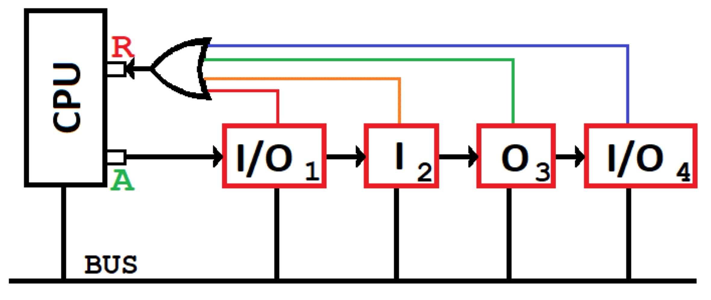

*   Advantages: fast because implemented in hardware; simple; scalable
*   Drawbacks: Fixed priority; not resilient to failures (if a device has a problem, the signal cannot propagate to the peripherals after it)

Please provide the picture of the organization (architecture) of an **Interrupt Controller** based I/O device management system where each Interrupt Controller unit can manage up to 3 devices and the number of I/O devices is 4. Please also briefly describe clearly and schematically what is an interrupt service routine, where it is found and what it does (in general)

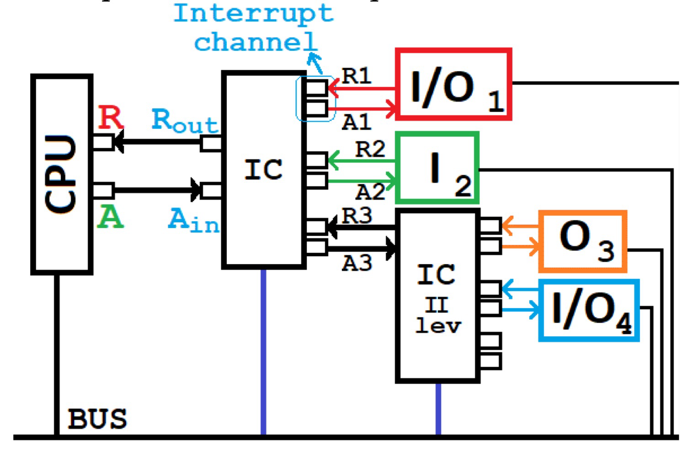

Suppose device 3 sends a request: it arrives to second level IC, which forwards it to its superior IC (first level) and then sends to the CPU. The CPU responds with an acknowledge signal , which the IC redirects to the proper channel, according to some priority: now the priority is managed by the IC.

## Locality Principle

Please discuss about the locality principles and what is their impact on the pipelining techniques

"If I am accessing a memory cell with address X now, then, I will access X again very likely at a very close time or I will access X±1 very likely at a very close time"

# Oral Questions

## Subtractor

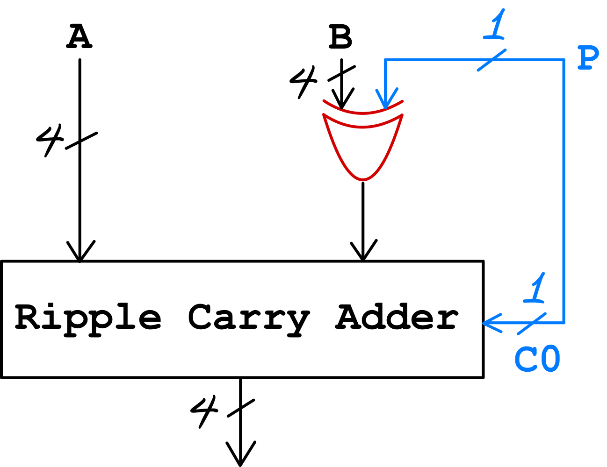

## Serial Adder

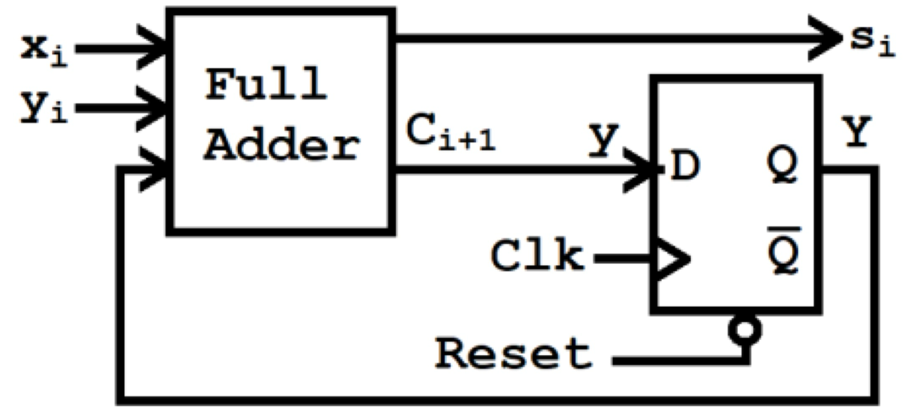

## Carry Lookahead Adder

We create a calculator for the carries and then use them to complete the final result in a circuit that calculates only the sums. Data received from a third party can be used in parallel

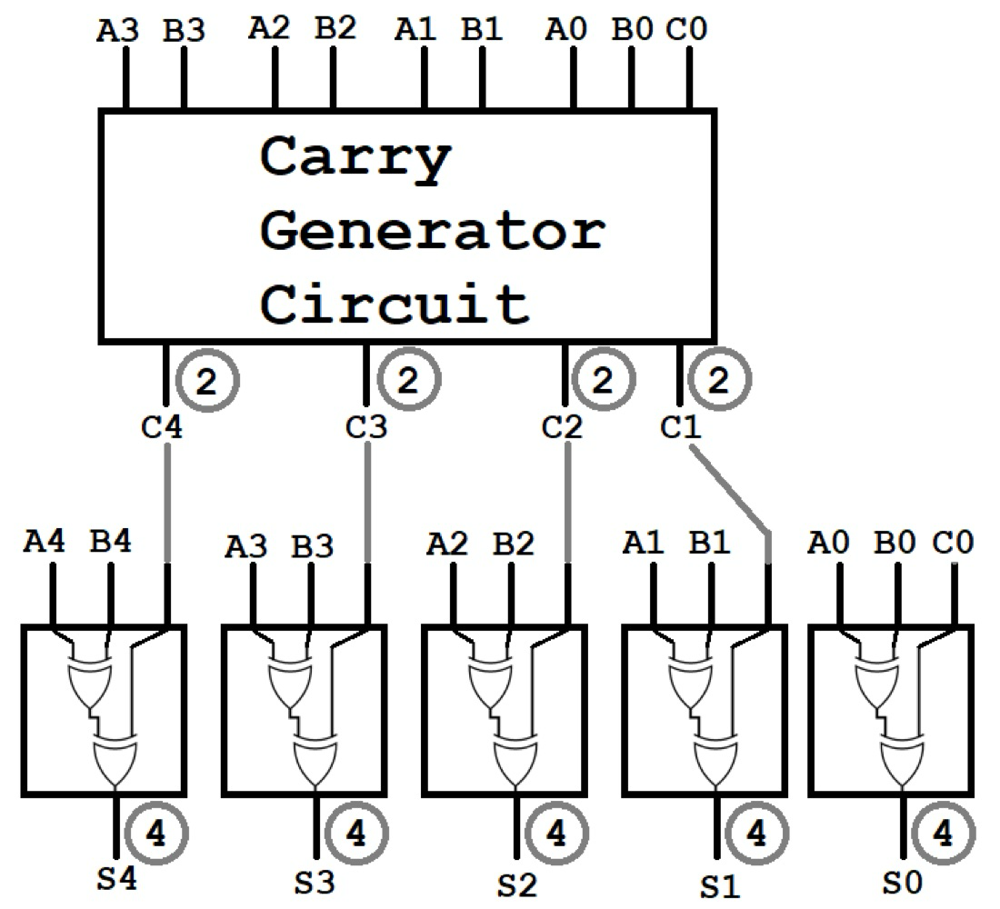

**Carry Generator** design: 
$$
\begin{align*}
c_0&=0\\
c_1&=A_0B_0+A_0C_0+B_0C_0\\
c_2&=A_1B_1+A_1C_1+B_1C_1=A_1B_1+A_1(A_0B_0+A_0C_0+B_0C_0)+B_1(A_0B_0+A_0C_0+B_0C_0)
\end{align*}
$$
Computing C2 requires an OR gate with 7 inputs:

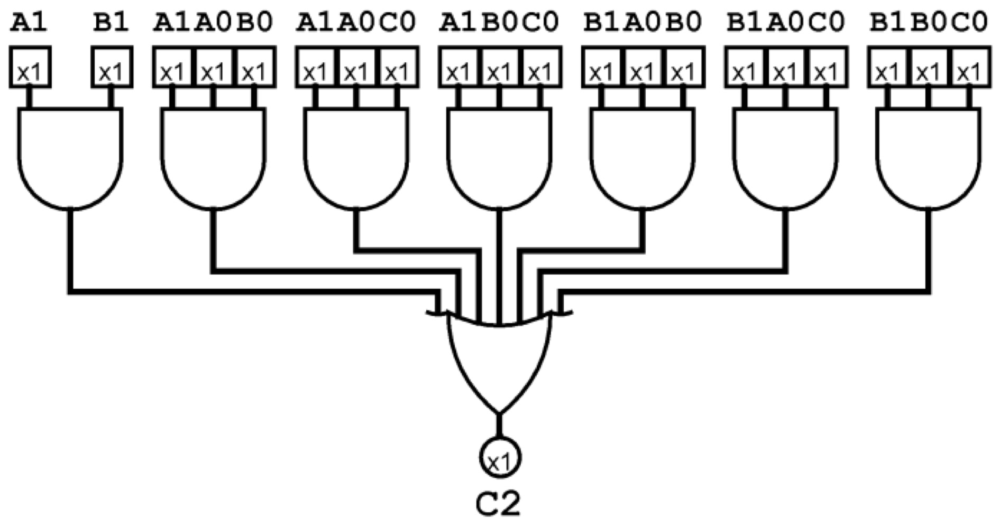

**Real physical implementation** for computing C2 is the following (3 levels instead of 2):

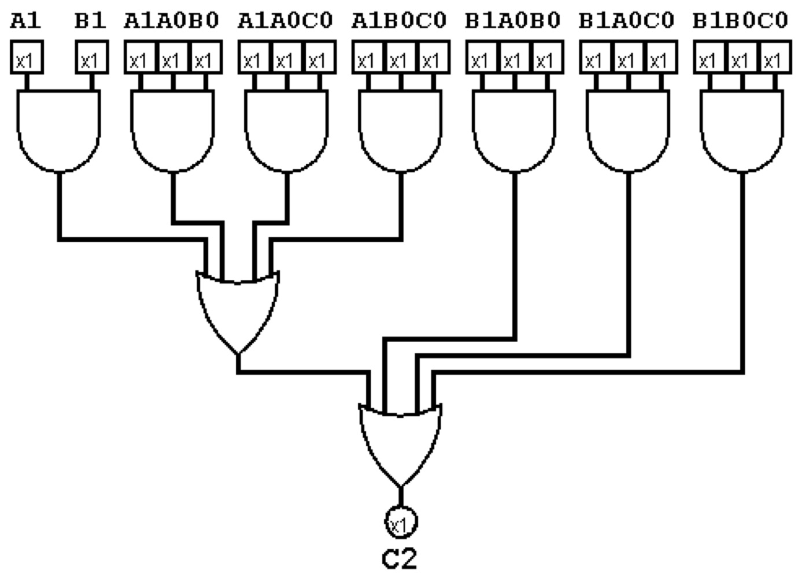

**Real Architecture** for 16 bits:

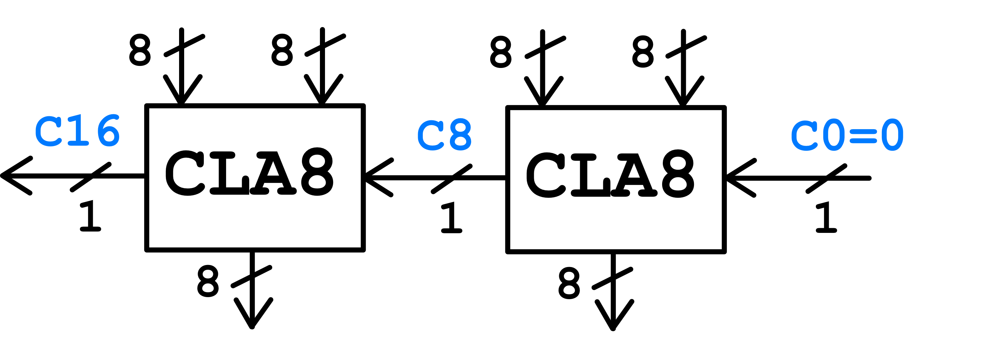

## Synchronous Counter

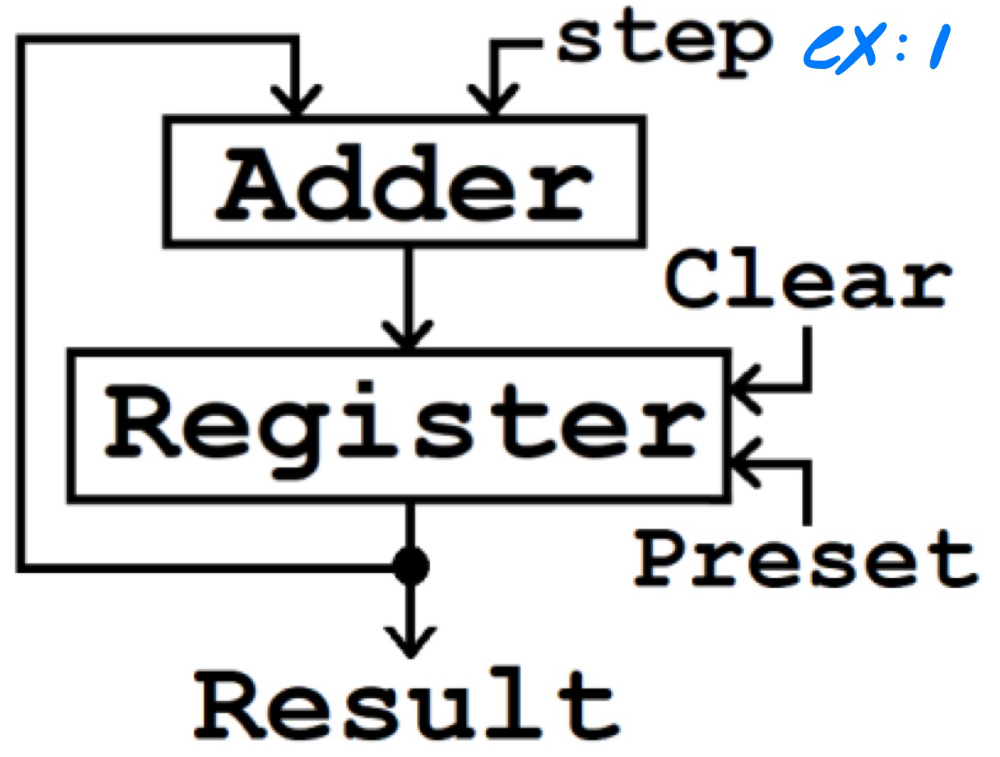

## Asynchronous Counter

**T flip-flop**:

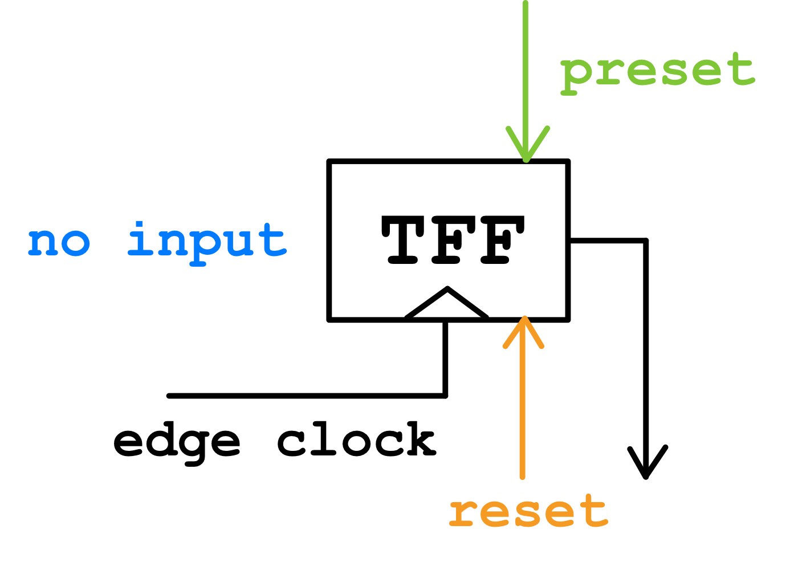

Function: Negates previously stored value responding to edge-clock, either low-to-high or high-to-low

Here is a **Down-Counter**:

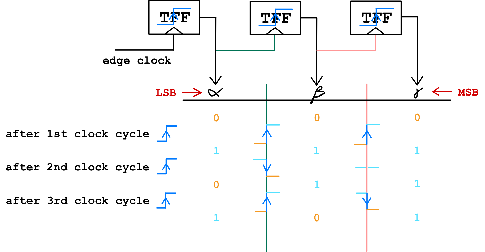

Design an **Up-Counter**:

*   Negates the output
*   Use TFFs that react to high-to-low

## Static & Dynamic Memory

| Static Memory                                                | Dynamic Memory                                               |
| ------------------------------------------------------------ | ------------------------------------------------------------ |
| Non-destructive reading No refresh Simple reading => faster access | Slower Reading "Destroy info" Leakage "Delete info" Periodic refresh is necessary Increase in latency Soft errors |

## Cache Address Mapping

*   **Direct Mapping: each main memory block is associated with only one possible cache line**

    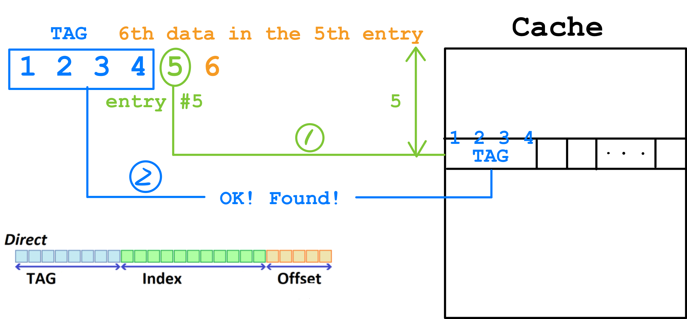

    *   Advantages: Simple and inexpensive to implement
    *   Drawbacks: There will be more than one address pointing to the same entry

*   **Full Associative Mapping: each main memory block can be loaded into any line of the cache**

    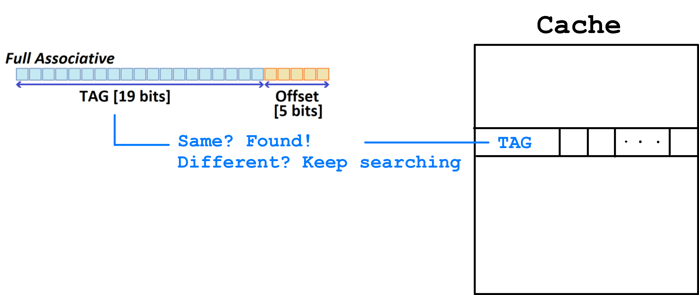

    *   Advantages: gives flexiblity as to which block to replace when a new block is read into the cache
    *   Disadvantages: many comparators cause expensive

*   **Set Associate Mapping**: Cache lines are grouped into sets, thus providing what is called a **k-way set associative cache** 

    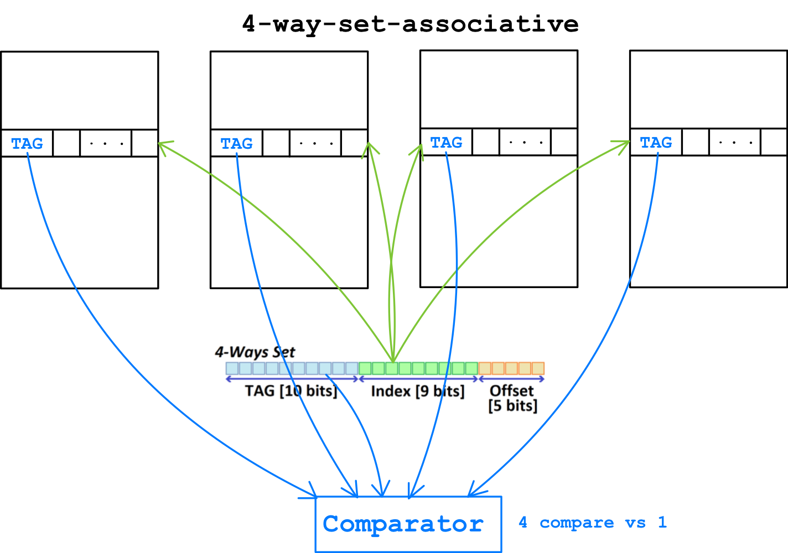

## Pipelining

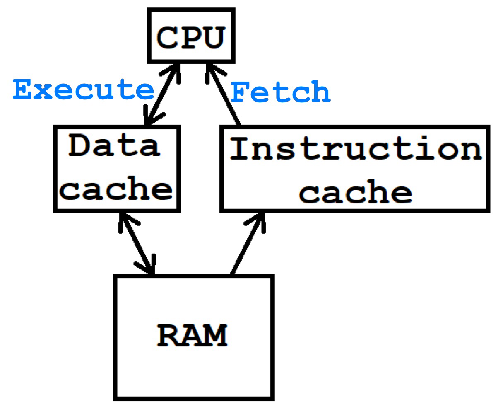