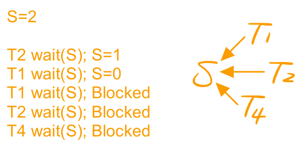
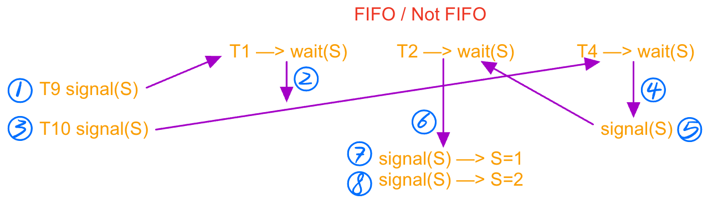
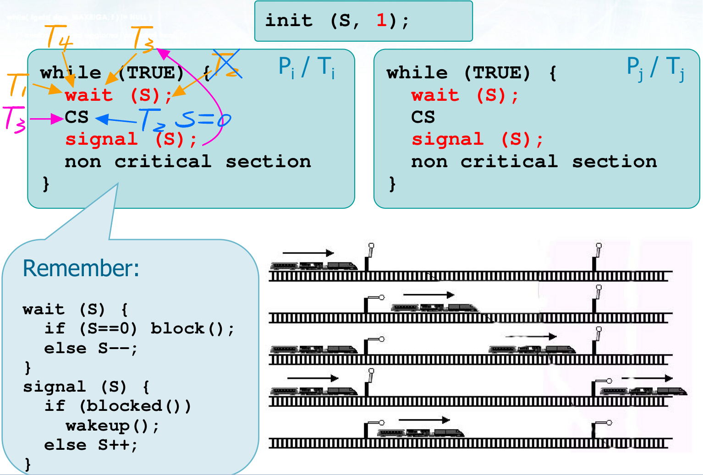
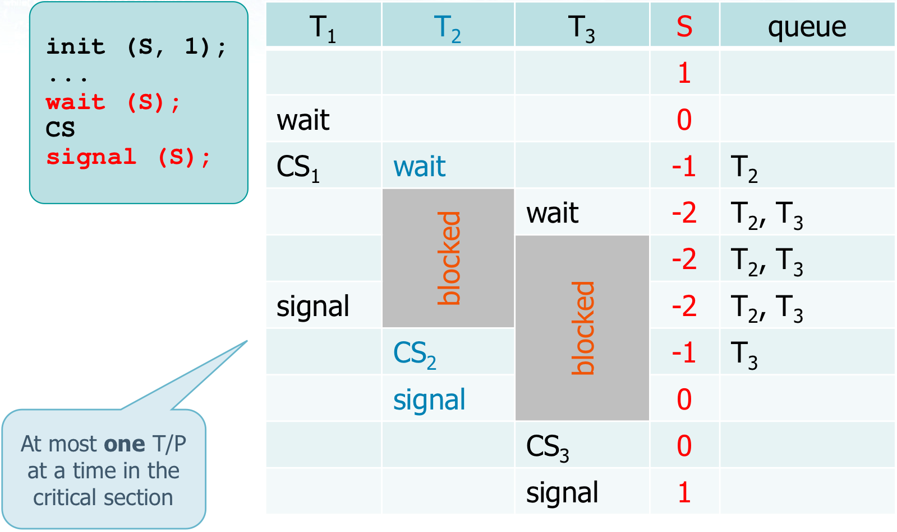
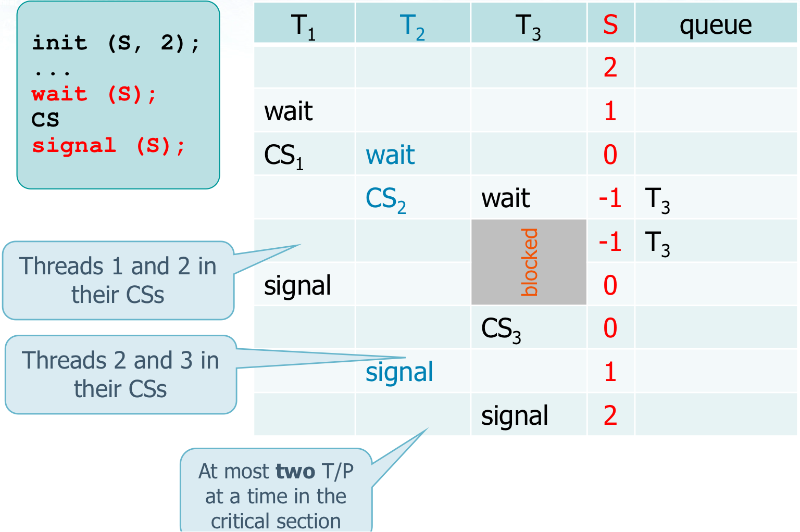

# Semaphores

## Definition

```c
typedef struct semaphore_tag {
  char lock; // Lock variable protects count and queue management
  int cnt; // Counter
  process_t *head; // Thread list
} semaphore_t;
```

* Operations on semaphore **S** are ==atomic==
	* Atomicity is managed by the OS
	* It is impossible for two threads to perform simultaneous operations on the same semaphore
* A semaphore **S** is
	* An integer shared variable
	* Protected by the operating system
	* Usable for mutual exclusion and synchronization
* Operation on **S** are always executed in an atomic way
	* The atomicity is guaranteed by the operating system
	* It is impossible for two processes to execute concurrent operations on the same semaphore


## Manipulation functions

Typical operations on a semaphore S

### init(S, k)

```c
// Logical implementation
init(S, k) {
  alloc(S);
  S = k;
}
```

* Defines and initializes semaphore S to value k
* Two types of semaphores
	* Binary semaphores (known as "mutex lock" (Mutual Exclusion))
		* The value of k is only **0** or **1**
	* Counting semaphores
		* The value of k is **non negative**


### wait(S)

```c
// Logical implementation
wait(S) {
  // In the logical versions S is always positive
  // Real implementations DO NOT use busy waiting
  while (S <= 0);
  S--;
}

// Other possible (and equivalent) logical implementation
wait(S) {
  if (S == 0) block();
  else S--;
}
```

* If the counter value of S is negative or zero blocks the calling T/P
	* If S is negative, its absolute value |S| indicates the number of waiting threads
* The counter is decremented at each call
* **Not to be confused** with the **`wait`** system call used to wait for a child process




### signal(S)

```c
// Logical implementation
signal(S) {
  S++;
}

// Other possible (and equivalent) logical implementation
signal(S) {
  if (blocked()) wakeup();
  else S++;
}
```

* Increases the semaphore S
	* If S counter is negative or zero some T/P was blocked on the semaphore queue, and it can be wake up
* **Not to be confused** with system call **`signal`**  that is used to declare a signal handler




### destory(S)

```c
// Logical implementation
destroy(S) {
  free(S);
}
```


* Release semaphore S memory
	* Actualy implementations of a semaphore require much more of a simple global variable to define a semaphore
* This functions is often not used in the examples


## Mutual exclusion with semaphore




## Critical sections of N threads






## Real Implementations

### POSIX Semaphores

* We will analyze only **unnamed** semaphores

	* The implementation is independent from the OS, and it is defined in the `semaphore.h` header file

		```c
		#include <semaphore.h>
		```

* The semaphore is a variable of type `sem_t`

	* A semaphore can be allocated statically or dynamically

		```c
		sem_t *sem1, *sem2, ...;
		```

		```c
		// Implemetation
		sem_t s;
		sem_t *sp;
		sp = (sem_t *) malloc(sizeof(sem_t));
		```

* Functions defined on semaphores

	* Are named `sem_*`
	* Return -1 on error


#### sem_init()

```c
int sem_init (
	sem_t *sem,
  int pshared,
  unsigned int value
);
```

```c
// Implementation
sem_init(&s, 0, 1);
sem_init(sp, 0, 1);
```

* Initializes the semaphore counter at value  `value`
* The `pshared` value identifies the type of semaphore
	* If equal to **0**, the semaphore is local to the **threads of current process**
	* Otherwise, the semaphore can be **shared between different processes** (parent that initializes the semaphore and its children)


#### sem_wait()

```c
int sem_wait (
	sem_t *sem
);
```

```c
// Implementation
sem_wait(&s);
sem_wait(sp);
```

* Standard wait
	* If the semaphore is equal to 0, it blocks the caller until it can decrease the value of the semaphore


#### sem_post()

```c
int sem_post (
	sem_t *sem
);
```

* Standard wait
	* Increments the semaphore counter, or wakes up a blocked thread if present


#### sem_destroy()

```c
int sem_destroy (
	sem_t *sem
);
```

```c
// Implementation
sem_destroy(&s);
sem_destroy(sp);
```

* Destroys the semaphore at the address pointed by sem
	* Destroying a semaphore that other threads are currently blocked on produces undefined behaviour (on error, -1 is returned)
	* Using a semaphore that has been destroyed produces undefined results, until the semaphore has been reinitialized


### Pthread mutex (Binary semaphores)

* A mutex is of type `pthread_mutex_t`

* Alternative to `sem_*` primitives, mutex is less general than semaphores (i.e., they can assume only the two values 0 or 1)


#### pthread_mutex_init()

```c
int pthread_mutex_init (
	pthread_mutex_t *mutex,
  const pthread_mutexattr_t *attr
);
```

* Initializes the mutex referenced by `mutex` with attributes specified by `attr` (default = NULL)
* Return value
	* 0 on success
	* Error code otherwise


#### pthread_mutex_lock()

```c
int pthread_mutex_lock (
	pthread_mutex_t *mutex
);
```

* Control the value of `mutex` and
	* Blocks the caller if the mutex is locked
	* Acquire the mutex lock if the mutex is unlocked
* Return value
	* 0 on success
	* Error code otherwise


#### pthread_mutex_unlock()

```c
int pthread_mutex_unlock (
	pthread_mutex_t *mutex
);
```

* Release the `mutex` lock (typically at the end of a Critical Section)
* Return value
	* 0 in success
	* Error code otherwise


#### pthread_mutex_destroy()

```c
int pthread_mutex_destroy (
	pthread_mutex_t *mutex
);
```

* Free `mutex` memory
* The mutex cannot be used any more
* Return value
	* 0 on success
	* Error code otherwise