# Threads

## From Process to Threads

* There are several cases where it would be useful to have
	* Lower creation and management costs
	* A single address space
	* Multiple execution threads (concurrency) within that address space
* Example: Web applications
	* A server must responds quickly to many access requests
	* The requests are submitted at the same time, and require similar processing of the data, etc

<center class="half">
  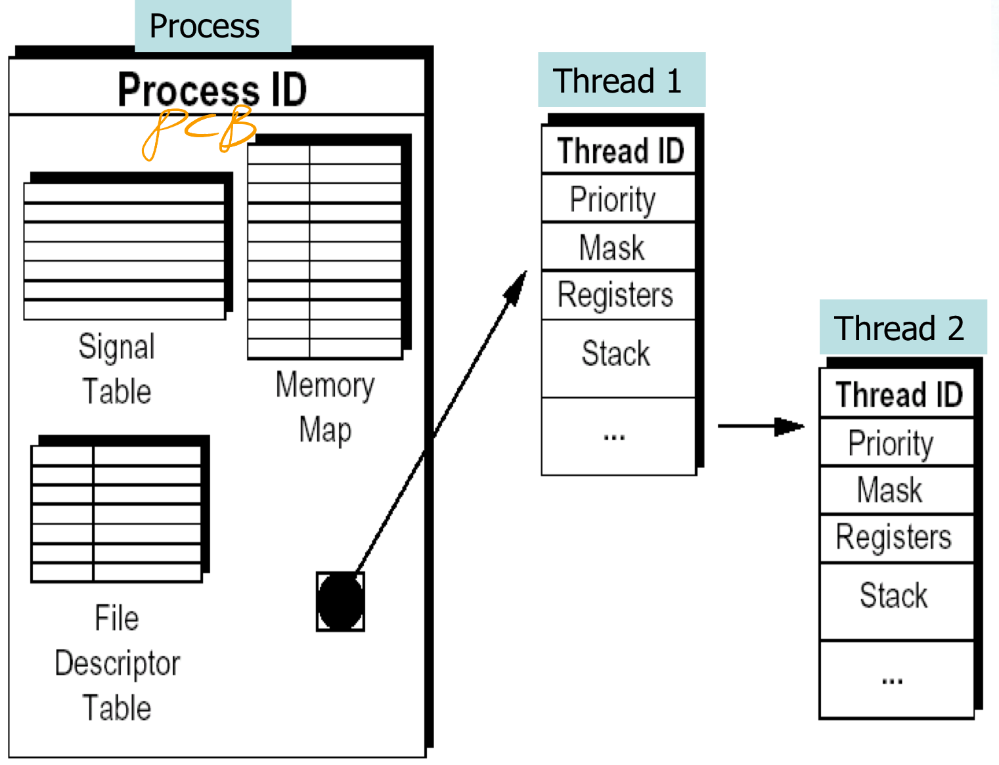
  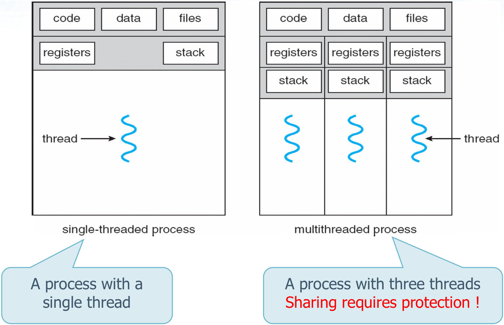
</center>


## Advantages

* Shorter response time
* Shared resources
* Lower costs for resource management
* Increased scalability


## Disadvantages

* There is no protection for threads
	* If the threads are **not synchronized**, access to shared data is **not thread safe**
* There is not a parent-child hierarchical relationship between threads


# Pthread Library

## Library Linkage

* The Pthread system calls are defined in `pthread.h`

* It is necessary to remember

	* To insert in the `.c` files

		```c
		#include <pthread.h>
		```

	* Compile your program linking the `pthread` library

		```bash
		gcc -Wall -g -o <exeName> <file.c> -lpthread
		```


## Thread Identifier

A thread is uniquely identified

* By a type identifier `pthread_t`, similar to the PID of a process (`pid_t`)
* The type `pthread_t` is opaque
	* It definition is implementation dependent
	* Can be used only by functions specifically defined in pthreads
	* It is not possible compare directly two identifiers or print their values
* It has meaning only within the process where the thread is executed
	* Remember that the PID is global within the system


## Pthreads

* Using Pthreads
	* A thread is a **function** that is executed in concurrency with the main thread
* The Pthreads library allows
	* Creating and manipulating threads
	* Synchronizing threads
	* Protection of resources shared by threads
	* Thread scheduling
	* Destroying thread
* It defines more than 60 functions, all functions have a `pthread_*` prefix

### pthread_equal()

```c
int pthread_equal (
  // Two thread identifiers
	pthread_t tid1,
  pthread_t tid2
);
```

* Compares two thread identifiers
* Returned values
	* Nonzero is the two threads are equal
	* Zero otherwise


### pthread_self()

```c
pthread_t pthread_self (
	void
);
```

* Returns the thread identifier of the calling thread
	* It can be used by a thread (with `pthread_equal`)  to self-identify


### pthread_create()

* At the begining , a program consists of one process and one thread

* `pthread_create`  allows creating a new thread

	* The maximum number of thread that can be created is undefined and implementation dependent

	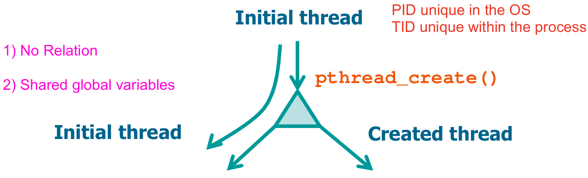

```c
int pthread_create (
	pthread_t *tid, // Identifier of the generated thread
  const pthread_attr_t *attr, // Thread attributes (NULL is the default attribute)
  void *(*startRountine) (void *), // C function executed by the thread
  void *arg // Argument passed to the start routine (NULL if no argument)
);
```

* Returned values
	* 0 on success
	* Error code on failure


### pthread_exit()

* A whole process (with all its threads) terminates if
	* Its thread calls `exit` (or `_exit` or `_Exit`)
	* The main thread execute `return`
	* The main thread receives a signal whose action is to terminate
* A single thread can be terminate (without affecting the other process threads)
	* Executing `return` from its start function, except main thread
	* Executing `pthread_exit`
	* Receiving a cancellation request performed by another thread using `pthread_cancel`

```c
void pthread_exit (
  // This value is available to the thread that calls pthread_join
	void *valuePtr
);
```

* It allows a thread to terminate returning a termination status


### pthread_join()

* If a thread
	* is **joinable**, its termination status is retained until another thread performs a `pthread_join` for that thread
	* is **detached** its termination status is immediately released
* In any case
	* A thread calling `pthread_join` waits until the required thread calls `pthread_exit`

```c
int pthread_join (
	pthread_t tid, // Identify (tid) of the waited-for thread
  // The void pointer ValuePtr will obtain the value returned by thread tid
  // it can be set to NULL if you are not interested in the return value
  void **valuePtr
);
```

* Used by a thread to wait the termination of another thread

	<center class="half">
	  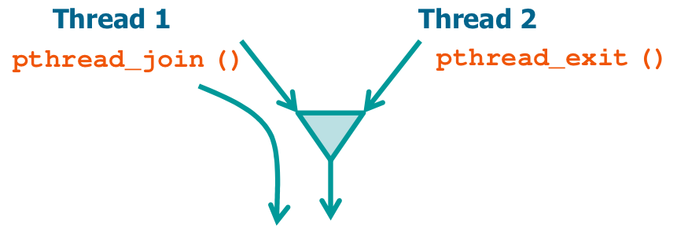
	  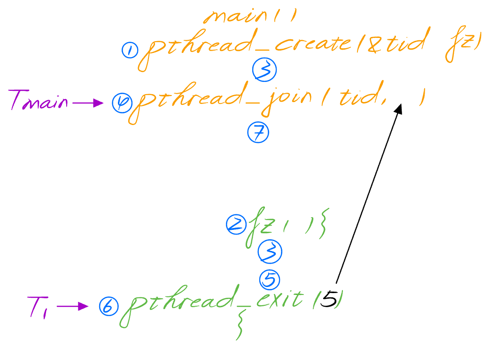
	</center>

* Returned values

	* 0 on success
	* Error code on failure
		* If the thread was detached `pthread_join` should fail (Depends on the OS and timing, it may also terminate correctly)
		* If it fails, it returns the constant `EINVAL` or `ESRCH`


### pthread_cancel()

```c
int pthread_cancel (
	pthread_t tid // Target thread (tid) identifier
);
```

* Terminates the target thread
	* The effect is similar to a call to `pthread_exit` performed by the target thread
* The thread calling `pthread_cancel` does not wait for termination of the target thread (it continues immediately after the calling)
* Returned values
	* 0 on success
	* Error code on failure


### pthread_detach()

```c
int pthread_detach (
	pthread_t tid // Thread (tid) identifier
);
```

* Declares thread `tid` as detached
	* The status information will not be kept by the kernel at the termination of the thread
	* No thread can join with that thread
	* Calls to `pthread_join` should fail with error code `EINVAL` or `ESRCH`
* Returned values
	* 0 on success
	* Error code on failure


### Examples of pthread_create() and pthread_exit()

#### Creation of 1 thread without parameters

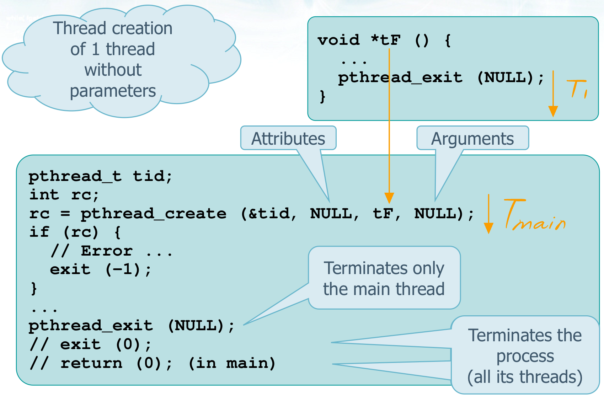

#### Creation of N threads with 1 argument

##### Wrong

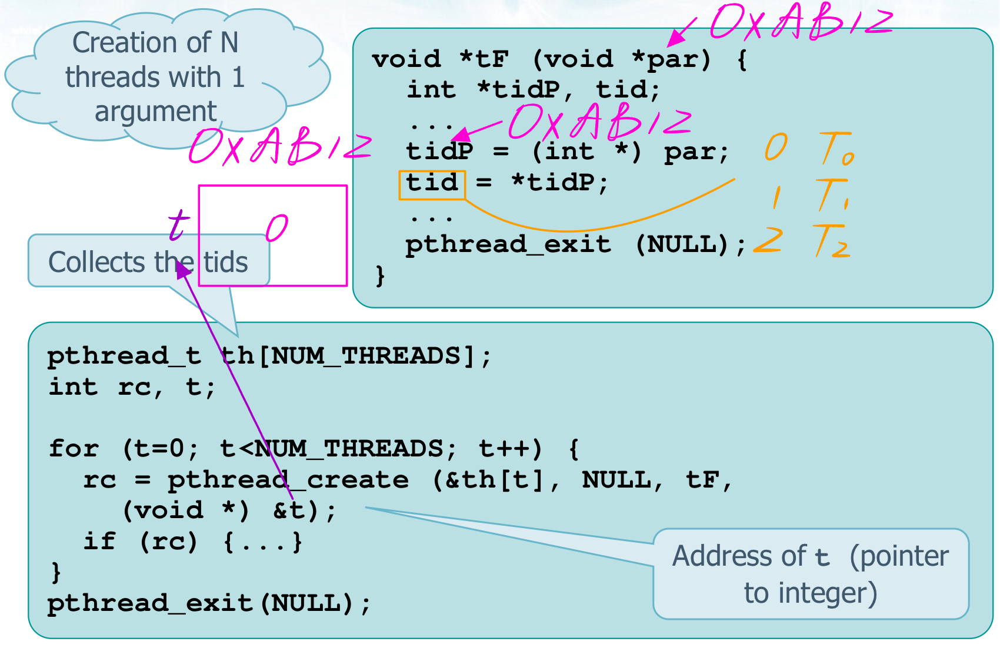

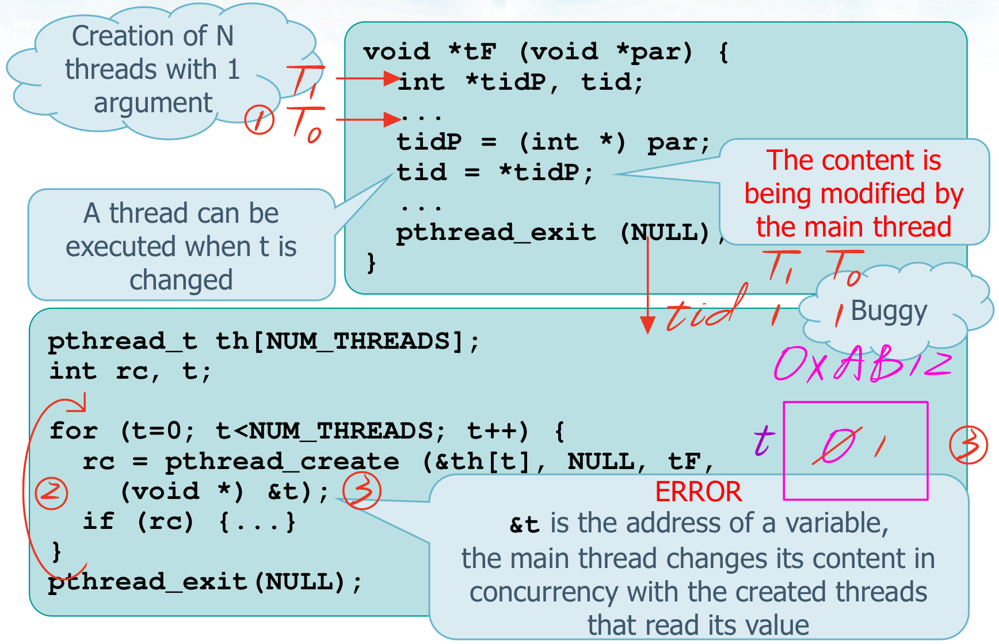

##### Correct

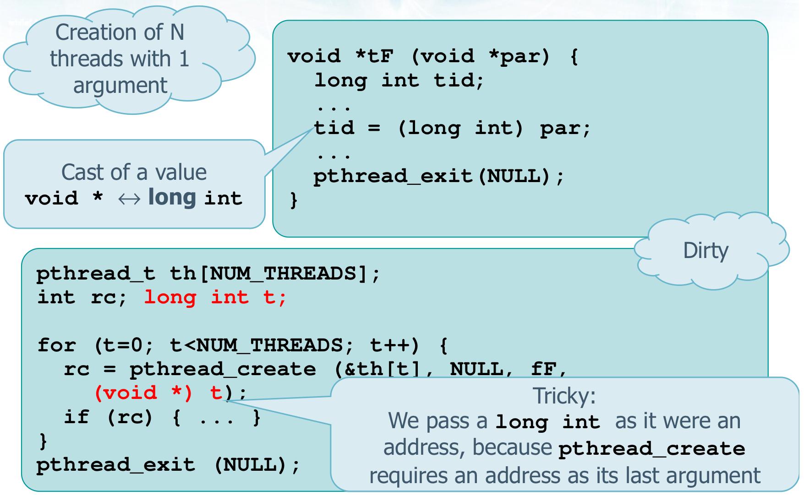

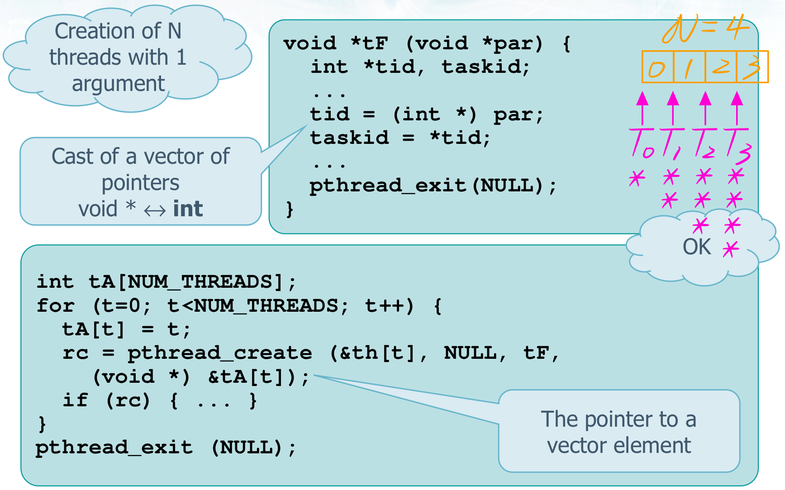

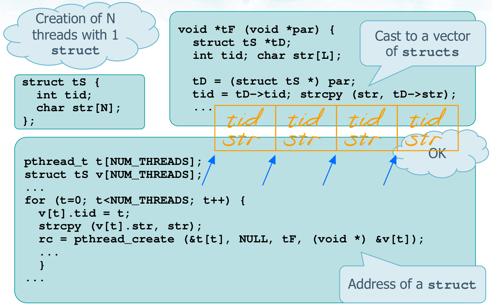


### Examples of pthread_join() and pthread_exit()

#### Returns the exit status (tid in this example)

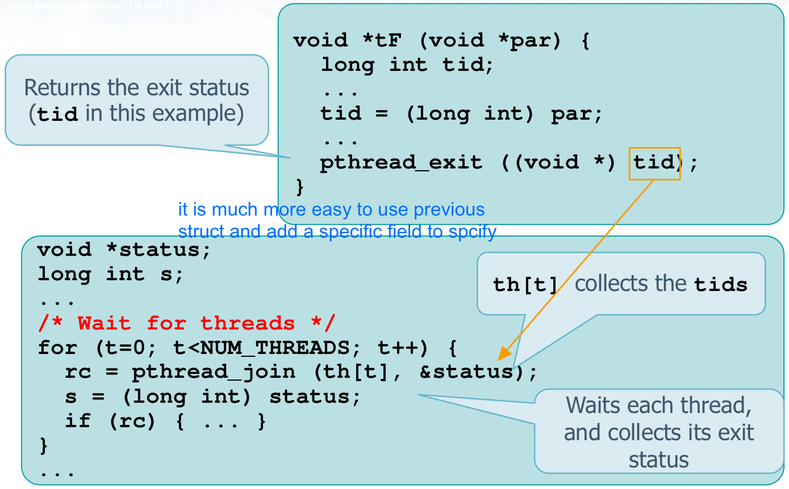

#### Use of a global variable common to many threads

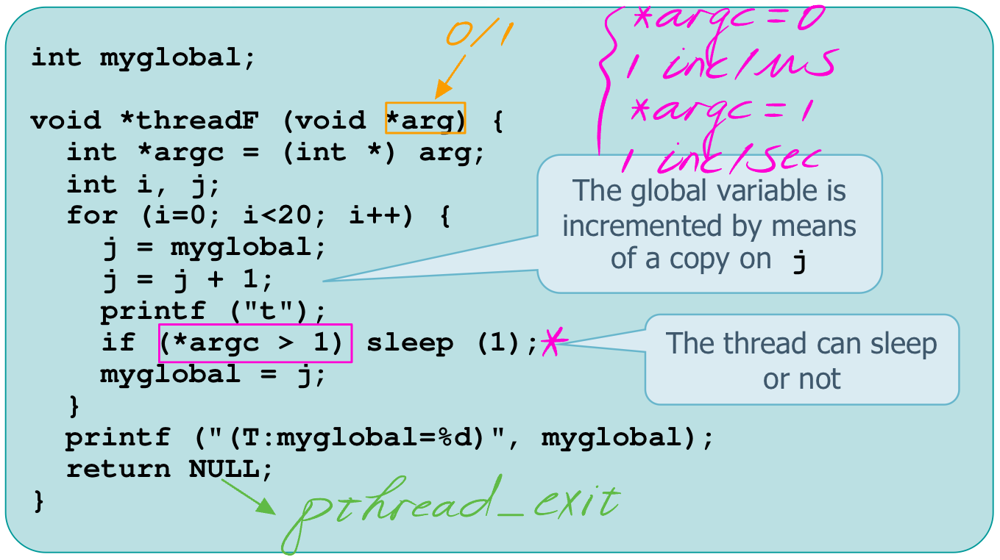

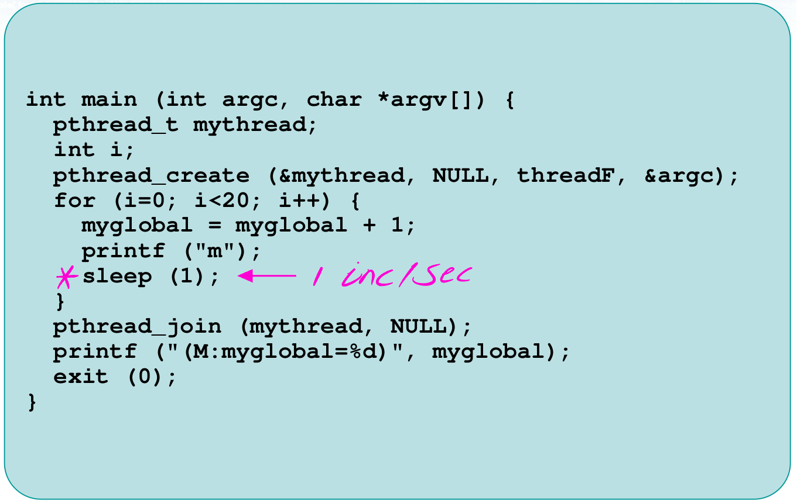

```bash
# If thread executes immediately; No loss of increments
> ./prog
mtttttttttttttttttttt(T:myglobal=21)mmmmmmmmmmmmmmmmmmm(M:myglobal=40)

# Thread and main thread alternates their execution every second; The increments of the thread are lost
> ./prog 1
mtmtmtmtmtmtmtmtmtmtmtmtmtmtmtmtmtmtmtmt(T:myglobal=21)(M:myglobal=21)

# 2sec waiting for the main thread; Only some increments are lost
> ./prog 1
mttmttmttmttmttmttmttmttmttmttm(T:myglobal=21)mmmmmmmmm(M:myglobal=30)
```

